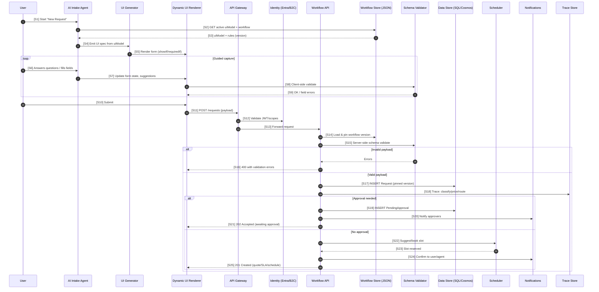

# Small-To-Medium-Business-Solutions

Here you go — a clear end-to-end view of how an **AI-assisted intake UI** is auto-generated from JSON rules and connected to a **REST API**.

# Sequence Diagram

---

# Step-by-step Table

| Step | From → To                     | Purpose / Action                    | Key Inputs                             | Output / Response                   | Notes                                 |
| ---- | ----------------------------- | ----------------------------------- | -------------------------------------- | ----------------------------------- | ------------------------------------- |
| S1   | User → AI Agent               | Begin guided intake                 | Intent: `create_request`               | Session started                     | Conversational or form-guided capture |
| S2   | AI Agent → Workflow Store     | Fetch active **uiModel + workflow** | `workflowId`, tenant/product           | JSON: `uiModel`, `rules`, `version` | Single source of truth                |
| S3   | Workflow Store → AI Agent     | Return active definitions           | —                                      | Same as above                       | Version is critical for pinning       |
| S4   | AI Agent → UI Generator       | Produce UI spec from `uiModel`      | `uiModel.sections/fields`              | Component spec (controls, layout)   | Can be React/meta JSON                |
| S5   | UI Generator → UI Renderer    | Render dynamic form                 | Component spec                         | Visible form with showIf/requiredIf | No hand-coded screens                 |
| S6   | User → AI Agent               | Provide answers/attachments         | Field values                           | Draft form state                    | Agent can suggest/auto-fill           |
| S7   | AI Agent → UI Renderer        | Update state/suggestions            | Normalized values                      | Updated form state                  | E.g., default category by text        |
| S8   | UI Renderer → Validator       | Client-side validation              | Field values, constraints              | Valid/invalid per field             | Types, regex, min/max, requiredIf     |
| S9   | Validator → UI Renderer       | Return validation status            | —                                      | Error list or OK                    | Inline errors for user                |
| S10  | User → UI Renderer            | Submit form                         | Final payload                          | Submit event                        | Triggers POST                         |
| S11  | UI Renderer → API Gateway     | `POST /requests`                    | Payload, JWT                           | 200-range/400                       | APIM policies (rate limit, headers)   |
| S12  | API Gateway → Identity        | Verify token/scopes                 | JWT                                    | Validated principal                 | Entra/B2C audience/scope checks       |
| S13  | API Gateway → Workflow API    | Forward request                     | Auth context, payload                  | —                                   | Internal authz if needed              |
| S14  | Workflow API → Workflow Store | Load & **pin** workflow version     | `workflowId`, tenant                   | Workflow JSON (version N)           | Pin stored on request for audit       |
| S15  | Workflow API → Validator      | Server-side schema validation       | Payload, schema derived from `uiModel` | OK or error list                    | Prevents client bypass                |
| S16  | Workflow API → UI Renderer    | Return validation errors            | Error list                             | **400 Bad Request**                 | Contains field paths/messages         |
| S17  | Workflow API → Data Store     | Persist request                     | Normalized payload, `workflow@version` | Row/Doc created (ID)                | Idempotency key recommended           |
| S18  | Workflow API → Trace Store    | Append step trace                   | Inputs/outputs per step                | JSONL entries                       | Enables replay/audit                  |
| S19  | Workflow API → Data Store     | Create approval record              | Gate ID, approvers                     | Pending approval row                | For gated flows only                  |
| S20  | Workflow API → Notifications  | Notify approvers                    | Request summary, link                  | Message queued/sent                 | Email/Teams/Slack                     |
| S21  | Workflow API → UI Renderer    | Acknowledge pending approval        | Request ID, gate info                  | **202 Accepted**                    | UI shows “Awaiting approval”          |
| S22  | Workflow API → Scheduler      | Suggest/book slot                   | Team/skills, SLA window                | Slot options or booking             | Pluggable service                     |
| S23  | Scheduler → Workflow API      | Return reserved slot                | Reservation ID                         | Slot confirmed                      | Attach to request                     |
| S24  | Workflow API → Notifications  | Confirm user/agent                  | Quote/SLA/slot                         | Messages sent                       | Customer & agent updates              |
| S25  | Workflow API → UI Renderer    | Return success payload              | Quote, SLA, schedule, IDs              | **201 Created**                     | Request visible in portal/inbox       |

If you want, I can tailor this for your Azure stack (APIM + Functions + SQL/Cosmos + Service Bus) and include sample payloads and response bodies for S11/S16/S21/S25.
