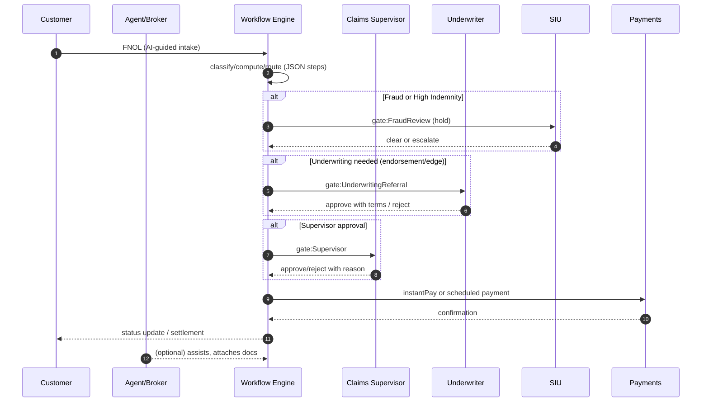
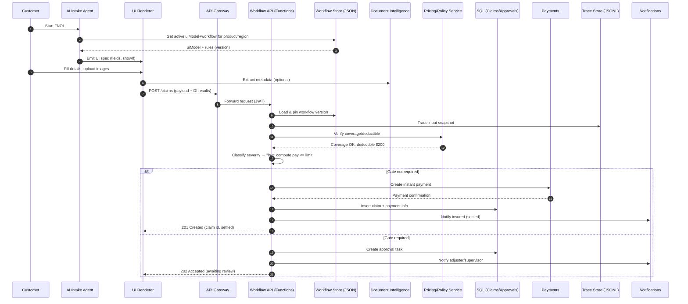
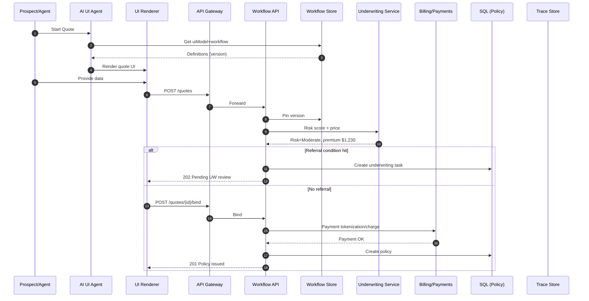

# Small-To-Medium-Business-Solutions for Insurance 

A mid-size insurer deploys a JSON-rules, AI-generated UI platform to streamline quotes, FNOL, and claims.
Customers or agents start in a guided intake where the UI is auto-built from a uiModel and validates in real time.
On submit, a workflow engine interprets JSON steps—classify, compute, gate, route, httpCall—to triage cases.
Coverage, pricing, and fraud checks run via pluggable services; simple claims flow straight through in seconds.
Threshold-based approval gates create timed tasks with one-click decisions, reminders, and escalation.
When approved, scheduling, payments, and notifications fire automatically, with SLA clocks visible to all.
Every decision pins the workflow version and writes a step-by-step trace for audit, replay, and compliance.
Business owners tweak SLAs, approvers, and pricing tiers by editing JSON, with schema checks and canary rollout.
The result is higher STP, lower cycle time and rework, fewer call-center updates, and happier policyholders.
During CAT surges, serverless scale and queues absorb spikes, preserving service levels and regulatory confidence.


---

Here’s a handy glossary of the acronyms we used across the solution—what they mean, where they fit, and why they matter.

| Acronym  | Stands for                               | In this solution                       | Why it matters                                       |
| -------- | ---------------------------------------- | -------------------------------------- | ---------------------------------------------------- |
| ACH      | Automated Clearing House                 | Claim payouts to bank accounts         | Low-cost electronic payments for settlements         |
| ADLS     | Azure Data Lake Storage                  | Stores decision traces, docs           | Durable, scalable object storage for audit/artifacts |
| AI       | Artificial Intelligence                  | UI agent, guidance, summaries          | Speeds intake, reduces errors, improves CX           |
| API      | Application Programming Interface        | All service endpoints                  | Standard way systems talk to each other              |
| APIM     | Azure API Management                     | Gateway in front of services           | Auth, rate limits, policies, observability           |
| B2C      | (Entra) Azure AD B2C / External ID       | Customer identity                      | Secure login for policyholders/agents                |
| BPMN     | Business Process Model & Notation        | Alternative process modeling (Camunda) | Visual, standard process diagrams                    |
| CAT      | Catastrophe (event)                      | Surge scenarios (storms, wildfires)    | Drives scale/spike handling requirements             |
| CDC      | Change Data Capture                      | Data pipeline option                   | Feeds analytics/lakes with incremental changes       |
| CLUE     | Comprehensive Loss Underwriting Exchange | External data for underwriting         | Prior loss history to assess risk                    |
| CMK      | Customer-Managed Key                     | Encryption key model                   | Customer controls data-at-rest keys                  |
| CRUD     | Create, Read, Update, Delete             | Resource operations                    | Core API patterns for every entity                   |
| DB       | Database                                 | Azure SQL for core records             | System of record for claims/policies                 |
| DI       | Document Intelligence                    | Extracts data from uploads             | Automates reading invoices/reports/photos            |
| DLP      | Data Loss Prevention                     | Security control                       | Prevents sensitive data exfiltration                 |
| DMN      | Decision Model & Notation                | Business decision tables               | Business-editable rules (pricing/triage)             |
| EXIF     | Exchangeable Image File Format           | Photo metadata checks                  | Fraud signals (timestamp/GPS mismatch)               |
| FNOL     | First Notice of Loss                     | Claim initiation flow                  | Starts the claims process                            |
| HTTP     | HyperText Transfer Protocol              | Transport for APIs                     | Ubiquitous web protocol for REST                     |
| ID       | Identifier                               | Entity primary keys                    | Referential integrity across systems                 |
| JSON     | JavaScript Object Notation               | Workflows, uiModel, payloads           | Human-readable, schema-validated config/data         |
| JSONL    | JSON Lines                               | Decision trace format                  | Append-only, easy to stream/analyze                  |
| JWT      | JSON Web Token                           | Auth token                             | Carries identity/roles to APIs                       |
| KPI      | Key Performance Indicator                | STP%, cycle time, SLA breaches         | Measures value/operational health                    |
| LOB      | Line of Business                         | Auto, Home, Commercial                 | Scopes rules/UI by product                           |
| ML       | Machine Learning                         | Fraud/triage/risk scoring              | Improves routing and leakage control                 |
| MVR      | Motor Vehicle Record                     | UW data source                         | Driver history for pricing/referrals                 |
| MTTR     | Mean Time To Recovery                    | Rollback speed for rules               | Safer, faster rule/config changes                    |
| NIGO     | Not In Good Order                        | Intake quality issue                   | Drives rework—fixed by adaptive UI/validation        |
| NPS      | Net Promoter Score                       | CX metric                              | Tracks customer satisfaction                         |
| OSINT    | Open-Source Intelligence                 | Fraud investigations                   | External signals for SIU reviews                     |
| PII      | Personally Identifiable Information      | Customer data                          | Must be masked/secured in traces and logs            |
| PoC      | Proof of Concept                         | Early prototypes                       | Validate approach before scaling                     |
| PSP      | Payment Service Provider                 | Confirms payments                      | Settlement confirmation callbacks                    |
| RBAC     | Role-Based Access Control                | AuthZ across personas                  | Ensures least-privilege access                       |
| REST     | Representational State Transfer          | API style used                         | Simple, resource-oriented, cacheable                 |
| RLS      | Row-Level Security                       | SQL tenant scoping                     | Enforces multi-tenant isolation in DB                |
| SLA      | Service Level Agreement                  | Timers/targets on steps                | Visibility & commitments for ops and CX              |
| SLO      | Service Level Objective                  | Platform reliability goals             | Targets for availability/latency                     |
| SRE      | Site Reliability Engineering             | Ops practice                           | Keeps the platform reliable at scale                 |
| SQL      | Structured Query Language                | Core relational store                  | Strong consistency & reporting                       |
| STP      | Straight-Through Processing              | No-touch claims/quotes                 | Cuts cost/time; boosts CX                            |
| UI       | User Interface                           | Forms auto-generated from uiModel      | Faster iterations; fewer errors                      |
| URL      | Uniform Resource Locator                 | Document/trace pointers                | Locates blobs and API resources                      |
| UUID     | Universally Unique Identifier            | IDs in APIs/DB                         | Collision-resistant identifiers                      |
| UW       | Underwriting / Underwriter               | Referral decisions                     | Human gate for risk/edge cases                       |
| WDL      | Workflow Definition Language             | Logic Apps’ JSON workflows             | JSON-native orchestration on Azure                   |
| Entra ID | Microsoft Entra ID (Azure AD)            | Identity provider                      | Central auth for staff and services                  |

# Problem (Current State)

## What’s breaking today

* **Inconsistent intake & rework**

  * Ten+ versions of FNOL/quote forms by product/region/carrier program.
  * Same fact asked multiple times; missing required fields; high NIGO (not-in-good-order) rates.
* **Manual triage & slow approvals**

  * Adjusters/underwriters eyeball severity, reserves, endorsements, discounts.
  * Email/Excel approvals with no SLA clock; “stuck” items are invisible.
* **Low straight-through processing (STP)**

  * Simple glass/towing/home-water-leak claims still wait for humans.
  * Quotes bounce to referral for routine edge cases.
* **Siloed systems & swivel-chair ops**

  * Policy admin, billing, claims, document storage, fraud tools don’t share a common contract.
  * Double entry between portals and core systems; brittle point-to-point integrations.
* **Poor transparency & auditability**

  * “Why was this claim denied?” often requires tribal knowledge.
  * No pinned rule version; hard to reproduce decisions for regulators or QA.
* **Fraud defense is reactive**

  * Basic red flags only; no fusion of rules + ML + external data in the decision moment.
* **Customer/agent experience lags**

  * No real-time status; limited self-service; high call volumes for “where is my claim/quote?”
* **CAT events overwhelm capacity**

  * Intake spikes cause backlogs; manual triage collapses SLA.
* **Tech debt**

  * Legacy monoliths, hard-coded rules, copy-pasted forms; changes require releases, not config.

## Pain points at a glance

| Pain Point             | Symptom                         | Likely Root Cause                                       | Business Impact                 | Affected Roles           |
| ---------------------- | ------------------------------- | ------------------------------------------------------- | ------------------------------- | ------------------------ |
| NIGO/Incomplete intake | Missing dates, coverage context | Static forms don’t adapt; no validation tied to product | Rework, delays, churn           | Customer, Agent, Ops     |
| Slow triage/approvals  | Days to move simple items       | Manual gates; email approvals; no timers                | SLA breaches, leakage           | Adjuster, UW, Supervisor |
| Low STP                | Humans handle simple claims     | Rules buried in code; no safe canary                    | High cost per claim, slow CX    | Claims, Finance          |
| Audit gaps             | Can’t replay a decision         | No version pinning/trace                                | Regulatory risk, disputes       | Compliance, Legal        |
| Integration drift      | Fragile hand-offs               | Point-to-point glue; no shared contract                 | Outages during changes          | IT, Ops                  |
| CAT surge              | Backlogs explode                | No autoscale, queues, or prioritization                 | SLA misses, reputational damage | Entire org               |

---

# Vision (Target State)

## North-star narrative

A **rules-defined, agent-rendered** platform: business rules and UI models live in JSON; an **AI agent autogenerates** the intake experience; a **workflow engine** executes steps (classify, compute, gate, route, httpCall) and **pins versions** for perfect audit. Humans only touch exceptions; everything else is **straight-through**.

## Design principles

1. **JSON is the contract**
   One artifact holds workflow steps + `uiModel`. Back end executes it; front end renders it.
2. **AI-generated interfaces**
   Forms and guided chat are generated from `uiModel` with validation, show/hide, and copy—no hand-coded screens.
3. **Human-in-the-loop by exception**
   Automatic routing + timers + approvals where thresholds/risk demand it.
4. **Explainable decisions**
   Every decision has a **trace** (inputs, expressions, outputs, actors) and a **pinned rule version**.
5. **Composable & pluggable**
   Pricing, coverage, fraud, payments, scheduling are separate services invoked via `httpCall`.
6. **Safe change management**
   JSON schema validation, linting, **canary rollout**, and one-click rollback; no Friday deploy fear.
7. **Privacy & least privilege**
   PII masking in traces, role-based unmasking, private endpoints, managed identities.

## What “good” looks like (outcomes)

* **Intake → decision in seconds** for simple claims/quotes; live **SLA clocks** for the rest.
* **STP uplift** on low-severity claims and simple endorsements; referrals only for genuine risk.
* **Single intake** that adapts by product/region via `uiModel` (web, mobile, chat share the same model).
* **Regulatory-grade audit**: “show me exactly which version and rule led to this outcome.”
* **Elastic operations**: queue-based, autoscaled services handle CAT surges gracefully.
* **Happier customers & agents**: real-time status, fewer calls, faster settlements, clearer reasons.

## Target KPIs (set baselines and measure weekly)

* **STP rate (simple claims)**: baseline X% → **target +25–40pp**
* **FNOL → first contact**: baseline H hours → **< 15 minutes**
* **Cycle time (minor claims)**: baseline D days → **−30%**
* **NIGO rate on intake**: baseline Y% → **−50%**
* **Referral rate (personal auto quotes)**: baseline R% → **−30%** without loss ratio degradation
* **Audit replay coverage**: baseline < 20% → **100%** decisions reproducible
* **CAT surge resilience**: process P95 FNOL within **< 5s** at 10× load

## Capability blueprint (what we build to hit the KPIs)

* **Rules & UI**

  * Versioned **workflow JSON** (switch/compute/gate/route/httpCall/waitUntil/set).
  * **`uiModel` JSON** driving AI-generated forms and conversational intakes.
  * Business-editable via Rule Editor (schema-validated, dry-run simulator, canary).
* **Decision services (pluggable)**

  * **Coverage check**, **Pricing/Rating**, **Fraud/Anomaly**, **Payments**, **Document Intelligence**.
* **Orchestration & state**

  * Workflow runtime with idempotency keys, step traces, pinned versions, timers.
  * **Approvals** with SLAs, reminders, and escalation paths.
* **Data & audit**

  * SQL for policies/claims/payments/approvals/workflow activations.
  * Immutable JSONL **decision traces** in object storage.
* **Experience**

  * Unified portal (web/mobile/chat) rendered from `uiModel`; status tracking; SLA clocks; document upload.
* **Ops**

  * Observability (distributed tracing, correlation IDs), SLO dashboards.
  * Security: Entra ID/B2C, private endpoints, Key Vault, DLP, PII masking.

## Anti-goals (what we won’t do)

* Hard-coding rules into UI or services.
* One-off forms per product/region.
* Manual, email-based approvals without timers or audit.
* Deploying rule changes without canary/rollback.

## Risks & mitigations

* **Rule sprawl** → enforce JSON schema + lint rules; product-line governance; naming/versioning conventions.
* **Over-automation** → clear exception routes; easy human override with reason logging.
* **Model bias/black-box** → use explainable features, thresholds, and human checkpoints; log inputs/outputs.
* **Integration churn** → standardize on `httpCall` adapters and contract tests; avoid point-to-point snowflakes.

## Business value narrative (how it pays)

* **Cost to serve** drops as STP rises and rework falls.
* **Speed** wins quotes and boosts NPS; faster settlements cut rental/handling costs.
* **Compliance** time falls with replayable decisions; disputes resolve faster.
* **Change velocity** increases: product tweaks ship as config, not code.

---


# Personas (Detailed)

## 1) Customer / Policyholder

* **Primary goals:** Report a loss (FNOL) fast, check claim status, upload docs/photos, receive payments quickly, request endorsements.
* **Critical decisions:** Confirm loss facts, select coverage options (deductible acknowledgement), accept settlement.
* **Typical inputs/outputs:** Loss type/date/location, photos, police report; outputs = claim ID, SLA clock, settlement status, payment confirmation.
* **Key UI (AI-generated from `uiModel`):** Guided FNOL form/chat, document upload, status timeline, settlement acceptance, bank details capture.
* **Workflow touchpoints:** Triggers `Claim.Created`; may pass `approvalGate` if injuries/high indemnity; can accept instant-pay.
* **Integrations:** eSign for releases, payments (ACH/Card), notifications (email/SMS).
* **Security:** B2C login, PII masking; can see **only** their policy/claim.
* **KPIs:** NIGO rate ↓, FNOL time ↓, satisfaction/NPS ↑.

## 2) Agent / Broker

* **Primary goals:** Create quotes, bind policies, submit FNOL on behalf of insureds, track book of business.
* **Critical decisions:** Coverage selections, endorsement requests, bind decision after price disclosure.
* **Inputs/outputs:** Prospect demographics/vehicle/home, prior losses; outputs = quote/premium, referral status, bind confirmation.
* **Key UI:** Quote wizard, comparison of coverages, bind & payment, endorsement forms, portfolio dashboard.
* **Workflow touchpoints:** `Quote.Created` → underwriting referral gate if thresholds hit; `Policy.Bind` after payment OK.
* **Integrations:** Payment tokenization, rating/price service, document generation (policy PDF).
* **Security:** Role = `Agent`; scoped to assigned customers; audit on premium overrides.
* **KPIs:** Bind rate ↑, quote turnaround ↓, referral rate ↓ without loss of quality.

## 3) Underwriter

* **Primary goals:** Evaluate risk, apply pricing/terms, clear referrals, enforce appetite & guidelines.
* **Critical decisions:** Accept/decline, apply surcharges/credits, request additional docs, set special conditions.
* **Inputs/outputs:** Referral packet (normalized data, risk score, prior losses, photos); outputs = decision, terms, notes.
* **Key UI:** Referral inbox, risk score explainability, document viewer, decision panel with rule references.
* **Workflow touchpoints:** Handles `gate:UnderwritingReferral`; decision resumes workflow (approve/reject/needs info).
* **Integrations:** External data (MVR, CLUE, property data), pricing/raters, document AI for attachments.
* **Security:** Role = `Underwriter`; can view/annotate risk factors; cannot alter payments.
* **KPIs:** Referral cycle time ↓, decision quality (loss ratio), guideline adherence.

## 4) Adjuster (Claim Handler)

* **Primary goals:** Verify coverage, set reserves, coordinate estimates/repairs, settle fairly and quickly.
* **Critical decisions:** Coverage confirmation, reserve levels, pay/deny/defer, salvage/subrogation initiation.
* **Inputs/outputs:** FNOL packet, estimates, medical/bodily injury docs; outputs = reserve changes, payment approvals, settlement terms.
* **Key UI:** Work queue by severity/SLA, claim timeline, reserve & payment panels, communications log.
* **Workflow touchpoints:** Picks up non-STP claims, completes tasks posted by `route` steps, triggers `approvalGate` where needed.
* **Integrations:** Estimating vendors, repair networks, medical review, payments.
* **Security:** Role = `Adjuster`; access limited by region/LOB; full audit trail on status or reserve changes.
* **KPIs:** Cycle time ↓, re-opens ↓, leakage ↓, SLA attainment ↑.

## 5) Claims Supervisor (Team Lead)

* **Primary goals:** Manage workload, approve exceptions, ensure SLA compliance, escalate when at risk.
* **Critical decisions:** Approve high indemnity/total loss/legal involvement; reassign workloads; override rules in rare cases.
* **Inputs/outputs:** Approval tasks with context & recommendations; outputs = approve/reject with reason, reassignment actions.
* **Key UI:** Approval inbox with timers, team capacity view, SLA breach dashboard, override panel with guardrails.
* **Workflow touchpoints:** Owner of `approvalGate` for claims; escalation routes/timeouts.
* **Security:** Role = `Supervisor`; can approve gates and reassign; override reasons required & audited.
* **KPIs:** Approval latency ↓, SLA breaches ↓, queue balance/aging ↓.

## 6) SIU / Fraud Analyst

* **Primary goals:** Investigate fraud signals, hold suspicious payments, coordinate with legal.
* **Critical decisions:** Place claim on hold, request additional verification, clear or refer to authorities.
* **Inputs/outputs:** ML anomaly scores, rule hits (red flags), network graphs; outputs = disposition (clear/confirmed/ongoing), notes, holds.
* **Key UI:** Fraud queue, score explanation, link analysis, hold/release actions.
* **Workflow touchpoints:** `gate:FraudReview` fires on thresholds; can pause `instantPay`; resume on clear.
* **Integrations:** OSINT, consortium data, device intelligence.
* **Security:** Role = `SIU`; restricted PII; strong audit on holds and releases.
* **KPIs:** Confirmed fraud detection ↑, false positives ↓, time-to-disposition ↓.

## 7) Ops Admin / Product Owner (Rules & UI)

* **Primary goals:** Change business rules and UI **without code**; canary & rollback; enforce governance.
* **Critical decisions:** SLA/pricing thresholds, approval chains, notification templates, `uiModel` field visibility.
* **Inputs/outputs:** Proposed JSON (workflow + `uiModel`), simulator results; outputs = activated version with rollout %.
* **Key UI:** Rule editor (JSON + schema validation), dry-run simulator, diff/compare, activation panel (canary %).
* **Workflow touchpoints:** Publishes `WorkflowDefinitions`; activates in `WorkflowActivations`; changes take effect on **new** items.
* **Security:** Role = `WorkflowAdmin`; dual-control for production activations; full audit (who/what/when/why).
* **KPIs:** Change lead time ↓, rollback MTTR ↓, policy compliance (lint pass rate) ↑.

## 8) Compliance / Audit

* **Primary goals:** Reconstruct “why/how” of any decision; verify adherence to regs; handle complaints and subpoenas.
* **Critical decisions:** Approve procedures, release audit packages, require corrective actions.
* **Inputs/outputs:** Decision traces (JSONL), pinned versions, approval logs; outputs = audit reports, remediation tickets.
* **Key UI:** Searchable audit console (by entity/date/actor), one-click “replay” view of steps & rules; export to PDF/CSV.
* **Workflow touchpoints:** Read-only access to traces & versions; no influence on runtime.
* **Security:** Role = `Auditor`; PII unmask with justification; everything logged.
* **KPIs:** Time to produce audit pack ↓, % reproducible decisions = 100%, findings ↓.

---

## Adjacent/supporting roles (brief)

* **Billing & Payments Ops:** reconciles payouts, handles reversals/chargebacks; UI = payment ledger; RBAC = `PaymentsOps`.
* **IT / SRE:** uptime, scaling, observability, policy enforcement; RBAC = `PlatformOperator`.

---

# Persona ↔ Workflow/API Mapping (Quick Matrix)

| Persona     | Typical Actions                             | Key Endpoints                                                           | Notable Gates/Steps                   |
| ----------- | ------------------------------------------- | ----------------------------------------------------------------------- | ------------------------------------- |
| Customer    | Create FNOL, upload docs, accept settlement | `POST /claims`, `GET /claims/{id}`, `POST /claims/{id}/accept`          | `classify`, `instantPay`, `notify`    |
| Agent       | Quote, bind, endorse                        | `POST /quotes`, `POST /quotes/{id}/bind`, `POST /policies/{id}/endorse` | `compute(price)`, `gate:Underwriting` |
| Underwriter | Clear referrals, adjust terms               | `POST /quotes/{id}/uw-decide`                                           | `gate:UnderwritingReferral`           |
| Adjuster    | Set reserves, approve payments              | `POST /claims/{id}/tasks`, `POST /payments`                             | `route(team)`, `gate:Supervisor`      |
| Supervisor  | Approve exceptions, reassign                | `POST /approvals/{id}/decide`, `POST /claims/{id}/reassign`             | `approvalGate`                        |
| SIU         | Hold/release, disposition                   | `POST /claims/{id}/siu-hold`, `POST /claims/{id}/siu-clear`             | `gate:FraudReview`                    |
| Ops Admin   | Activate rules/UI                           | `POST /workflows`, `POST /workflows/{id}:activate`                      | Version pinning/canary                |
| Auditor     | Retrieve traces                             | `GET /requests/{id}/trace`                                              | Read-only                             |

---

# Swimlane (who touches what in a gated claim)


---

# 2) FNOL Straight-Through (low-severity glass) (F1–F16)

| Step | From → To                      | What happens                                      | Why (purpose)                         | Key data / artifacts           |
| ---- | ------------------------------ | ------------------------------------------------- | ------------------------------------- | ------------------------------ |
| F1   | Customer → AI Agent            | “Start FNOL.”                                     | Begin guided loss intake.             | Session, intent.               |
| F2   | AI Agent → Workflow Store      | Get active `uiModel` + workflow.                  | Render right form for product/region. | Workflow+UI JSON (version).    |
| F3   | Store → AI Agent               | Return definitions.                               | Provide render/rules.                 | Version N.                     |
| F4   | AI Agent → UI Renderer         | Emit UI spec (fields, showIf).                    | Build dynamic intake.                 | Components, visibility rules.  |
| F5   | Customer → UI Renderer         | Fill details, upload photos.                      | Capture evidence quickly.             | Loss type/date, images.        |
| F6   | UI Renderer → Doc Intelligence | Extract metadata (optional).                      | Pre-fill & verify facts.              | Timestamps, objects, EXIF.     |
| F7   | UI Renderer → API Gateway      | `POST /claims` with payload + DI results.         | Create claim.                         | JWT, payload, files’ URIs.     |
| F8   | Gateway → Workflow API         | Forward request.                                  | Reach engine.                         | Auth ctx + body.               |
| F9   | Workflow API → Store           | Load & **pin** workflow version.                  | Audit/replay later.                   | `claims.fnol.auto@vN`.         |
| F10  | Workflow API → Trace Store     | Trace input snapshot.                             | Evidence trail.                       | JSONL line #1.                 |
| F11  | Workflow API → Policy/Rating   | Verify coverage/deductible.                       | Eligibility & amounts.                | Coverage OK; deductible \$200. |
| F12  | Policy/Rating → Workflow API   | Return coverage check result.                     | Continue decisioning.                 | Limits/deductible.             |
| F13  | Workflow API (self)            | Classify severity; compute pay.                   | Decide STP vs manual.                 | Severity = “low”, pay ≤ limit. |
| F14a | Workflow API → Payments        | **Instant pay** (if STP).                         | Delight customer, reduce cycle time.  | Payout request.                |
| F15a | Payments → Workflow API        | Payment confirmation.                             | Ensure funds moved.                   | TxnRef/status.                 |
| F16a | Workflow API → DB/Notif/UI     | Persist claim + payment; notify; **201 Created**. | Close case STP.                       | Claim id, settled flag.        |
| F14b | Workflow API → DB              | Create approval task (if gated).                  | Human review needed.                  | Approval row.                  |
| F15b | Workflow API → Notifications   | Notify adjuster/supervisor.                       | Prompt action.                        | Gate deeplink.                 |
| F16b | Workflow API → UI              | **202 Accepted** (awaiting review).               | Show pending state.                   | Gate info, SLA timer.          |

*(a = STP branch, b = gated branch)*


---


# Data & Permissions (at a glance)

* **Row-level security:** `TenantId` filter for all business tables; persona roles scoped by LOB/region where needed.
* **Audit invariants:** Any **decision** (approve/reject, status change, reserve change, payment) must log to `ins.AuditEvents`.
* **Privacy:** PII masked by default in traces; `Auditor` can unmask with justification.

---


## Outcomes & KPIs

* **STP rate**: ≥ 40% for simple glass/towing/low-severity claims
* **FNOL→First Contact**: < 15 minutes (target)
* **Cycle time**: −30% on minor claims; −15% on moderate claims
* **Fraud leakage**: −10% with ML triage + rule gates
* **Bind rate**: +8% via faster quote; abandonment < 10%
* **Audit completeness**: 100% with pinned workflow versions & decision traces

---

# Core Journeys

## A) Quote → Bind (Personal Auto/Home)

1. **Intake** (AI-generated UI from `uiModel`): driver/home details, prior losses, coverages, limits.
2. **Risk & Price**: rules + ML signals (credit surrogate, telematics, roof condition) compute premium; discounts via tier rules.
3. **Referral Gate**: triggers if premium change > threshold, risk score > cutoff, or missing docs.
4. **Bind**: payment and e-policy issuance; documents e-signed; policy ID created; endorsements enabled.

## B) FNOL → Settlement (Claims)

1. **FNOL intake** (AI chat or form from `uiModel`), upload photos, police report, telematics.
2. **Triage & Routing**: JSON rules classify severity, set reserves, assign adjuster/team or go STP.
3. **Approval Gates**: total loss, injury, or high indemnity require supervisor/legal approval.
4. **Estimate & Settlement**: integrate estimating vendor; if within limits and low-risk → **instant pay**; else to adjuster.
5. **Subrogation/Salvage**: if third-party involved or vehicle totaled, create subro/salvage tasks.
6. **Closure**: notify insured, update reserves/final pay, archive decision trace.

## C) Fraud & Triage

* **Rule + ML hybrid**: rules for known patterns (mismatched garaging, late add of coverage), ML for anomaly score.
* **SIU Gate**: if score > threshold or rule hits, route to SIU; otherwise proceed.

## D) Endorsements & Mid-Term Changes

* **UI agent** prompts only fields impacted; rules compute pro-rata premium change; approvals as needed.

---

# Reference Architecture (Azure-lean)

* **UI (web/mobile)**: Generated by AI agent from `uiModel` JSON; renders forms/conversation.
* **API Gateway**: Azure API Management (JWT, rate limit, IP allowlist, headers).
* **Workflow Runtime**: Azure Functions (HTTP + queue triggers) evaluating **JSON steps** (`switch`, `compute`, `gate`, `route`, `httpCall`, `waitUntil`).
* **Rules & UI Models**: Cosmos DB or Blob for **immutable** versions (`workflowId@version` + `uiModel`).
* **Data**:

  * Azure SQL: policies, claims, payments, reserves, approvals, activations.
  * ADLS/Blob: documents (photos, PDFs), decision traces (JSONL).
* **Events/Async**: Service Bus (claim tasks), Event Grid (status events).
* **AI**: Azure OpenAI (UI agent, summarization), Document Intelligence (form extraction), Vision (damage severity), optional Telematics via Event Hubs.
* **Analytics**: Synapse/Databricks + Power BI (KPIs, leakage, SLA, fraud).
* **Security**: Entra ID/B2C, Managed Identity, Key Vault, Private Endpoints, Defender for Cloud.
* **Observability**: App Insights + Log Analytics (end-to-end traces).

---

# Sequence Diagrams

## 1) FNOL Straight-Through (low-severity glass)


---

# 1) AI-assisted Intake → API → Workflow (S1–S25)

| Step | From → To                     | What happens                                          | Why (purpose)                   | Key data / artifacts                 |
| ---- | ----------------------------- | ----------------------------------------------------- | ------------------------------- | ------------------------------------ |
| S1   | User → AI Agent               | User starts a new request (“create\_request”).        | Kick off guided capture.        | Intent name, session id.             |
| S2   | AI Agent → Workflow Store     | Fetch active `uiModel` + workflow for tenant/product. | Get single source of truth.     | `workflowId`, `product`, `tenantId`. |
| S3   | Workflow Store → AI Agent     | Return `uiModel`, rules, version.                     | Provide render + rule context.  | JSON (versioned).                    |
| S4   | AI Agent → UI Generator       | Produce component spec from `uiModel`.                | Define the actual UI.           | Layout, fields, showIf/requiredIf.   |
| S5   | UI Generator → Renderer       | Render dynamic form.                                  | Present inputs with validation. | Rendered controls, hints.            |
| S6   | User → AI Agent               | User answers questions / uploads docs.                | Collect facts efficiently.      | Field values, files.                 |
| S7   | AI Agent → Renderer           | Normalizes values, provides suggestions.              | Reduce user effort/typos.       | Normalized state.                    |
| S8   | Renderer → Validator          | Client-side validate.                                 | Catch issues early.             | Types, ranges, requiredIf.           |
| S9   | Validator → Renderer          | Return per-field errors/OK.                           | Feedback loop.                  | Error list.                          |
| S10  | User → Renderer               | Submit.                                               | Move to server workflow.        | Final payload.                       |
| S11  | Renderer → API Gateway        | `POST /requests` (or domain create).                  | Enter backend safely.           | JWT, idempotency key.                |
| S12  | Gateway → Identity            | Validate token/scopes.                                | Security gate.                  | Principal/roles.                     |
| S13  | Gateway → Workflow API        | Forward request.                                      | Reach engine.                   | Payload + auth ctx.                  |
| S14  | Workflow API → Workflow Store | Load & **pin** active version.                        | Auditability/replay.            | `workflowId@version`.                |
| S15  | Workflow API → Validator      | Server-side schema validation.                        | Enforce contract.               | Schema derived from `uiModel`.       |
| S16  | Workflow API → Renderer       | 400 with errors (if invalid).                         | Return actionable fixes.        | Field paths/messages.                |
| S17  | Workflow API → DB             | Persist request row.                                  | Durable state.                  | Request id, workflow ref.            |
| S18  | Workflow API → Trace Store    | Write step trace snapshot.                            | Explainability/audit.           | JSONL trace entry.                   |
| S19  | Workflow API → DB             | Create **PendingApproval** (if needed).               | Human-in-loop.                  | Approval row(s).                     |
| S20  | Workflow API → Notifications  | Notify approvers (email/Teams/etc.).                  | Fast decisions.                 | Deep-link to approve/reject.         |
| S21  | Workflow API → Renderer       | **202 Accepted** awaiting approval.                   | Show status & SLA.              | Gate info, timers.                   |
| S22  | Workflow API → Scheduler      | Suggest/book slot (if no gate).                       | Automate fulfillment.           | Team/skills/SLA window.              |
| S23  | Scheduler → Workflow API      | Return reserved slot.                                 | Confirm scheduling.             | Slot id/time/resource.               |
| S24  | Workflow API → Notifications  | Confirm to user/agent.                                | Close communication loop.       | Quote/SLA/slot details.              |
| S25  | Workflow API → Renderer       | **201 Created** (or similar).                         | Final success path.             | IDs, SLA, schedule, quote.           |

---

## 2) Quote → Bind (referral on risk)


---

# 3) Quote → Bind (referral on risk) (Q1–Q15)

| Step | From → To                          | What happens                                         | Why (purpose)                   | Key data / artifacts       |
| ---- | ---------------------------------- | ---------------------------------------------------- | ------------------------------- | -------------------------- |
| Q1   | Prospect/Agent → AI Agent          | “Start Quote.”                                       | Launch guided quote flow.       | Session, product.          |
| Q2   | AI Agent → Workflow Store          | Get `uiModel` + quote workflow.                      | Render correct quote form.      | JSON defs (version).       |
| Q3   | Store → AI Agent                   | Return definitions.                                  | Provide render/rules.           | Version N.                 |
| Q4   | AI Agent → UI Renderer             | Render quote UI (coverage choices, drivers, assets). | Collect risk & coverage prefs.  | Components, validations.   |
| Q5   | Prospect/Agent → UI Renderer       | Enter risk data & selections.                        | Gather rating inputs.           | Drivers, vehicles, limits. |
| Q6   | UI Renderer → API Gateway          | `POST /quotes`.                                      | Create a quote.                 | JWT, payload.              |
| Q7   | Gateway → Workflow API             | Forward to engine.                                   | Execute rules.                  | Payload + auth ctx.        |
| Q8   | Workflow API → Store               | **Pin** workflow version.                            | Auditability.                   | `quotes.auto.default@vN`.  |
| Q9   | Workflow API → Underwriting/Rating | Request risk score + price.                          | Decide premium & referral need. | Risk score, base rate.     |
| Q10  | UW/Rating → Workflow API           | Return risk & premium.                               | Continue flow.                  | e.g., Moderate / \$1,230.  |
| Q11a | Workflow API → DB                  | Create **UW referral** task (if rule hit).           | Human review for risk.          | Referral record.           |
| Q12a | Workflow API → UI                  | **202 Pending UW review**.                           | Set expectations.               | Referral id/status.        |
| Q11b | UI Renderer → API Gateway          | `POST /quotes/{id}/bind` (no referral path).         | Proceed to bind.                | Payment token, acceptance. |
| Q12b | Gateway → Workflow API             | Execute bind.                                        | Issue policy.                   | Quote id, payment info.    |
| Q13b | Workflow API → Billing             | Tokenize/charge payment.                             | Collect premium.                | Charge request.            |
| Q14b | Billing → Workflow API             | Payment OK.                                          | Confirm funds.                  | TxnRef/status.             |
| Q15b | Workflow API → DB/UI               | Create policy; return **201 Policy issued**.         | Complete sale.                  | Policy id, docs link.      |

*(a = referral branch, b = straight-through bind branch)*

---

Set Up Steps 

Creating a serverless API using Azure that leverages Service Bus to communicate with an SQL Database involves several steps. Here's a high-level overview of how you can set this up:

1. **Set Up Azure SQL Database**:
   - Create an Azure SQL Database instance.
   - Set up the necessary tables and schemas you'll need for your application.

2. **Create Azure Service Bus**:
   - Set up an Azure Service Bus namespace.
   - Within the namespace, create a queue or topic (based on your requirement).

3. **Deploy Serverless API using Azure Functions**:
   - Create a new Azure Function App.
   - Develop an HTTP-triggered function that will act as your API endpoint.
   - In this function, when data is received, send a message to the Service Bus queue or topic.

4. **Deploy 2 Service Bus Triggered Function**:
   - Create another Azure Function that is triggered by the Service Bus queue or topic.
   - This function will read the message from the Service Bus and process it. The processing might involve parsing the message and inserting the data into the Azure SQL Database.

5. **Deploy a Timer Triggered Function**:
   - Create another Azure Function that is triggered when a file is dropped in a container.
   - This function will stream in a file, read it and place on the service bus topic.

6. **Implement Error Handling**:
   - Ensure that you have error handling in place. If there's a failure in processing the message and inserting it into the database, you might want to log the error or move the message to a dead-letter queue.

7. **Secure Your Functions**:
   - Ensure that your HTTP-triggered function (API endpoint) is secured, possibly using Azure Active Directory or function keys.

8. **Optimize & Monitor**:
   - Monitor the performance of your functions using Azure Monitor and Application Insights.
   - Optimize the performance, scalability, and cost by adjusting the function's plan (Consumption Plan, Premium Plan, etc.) and tweaking the configurations.

9. **Deployment**:
   - Deploy your functions to the Azure environment. You can use CI/CD pipelines using tools like Azure DevOps or GitHub Actions for automated deployments.

By following these steps, you'll have a serverless API in Azure that uses Service Bus as a mediator to process data and store it in an SQL Database. This architecture ensures decoupling between data ingestion and processing, adding a layer of resilience and scalability to your solution.


## Appplication Setting 

|Key|Value | Comment|
|:----|:----|:----|
|AzureWebJobsStorage|[CONNECTION STRING]|RECOMMENDATION :  store in AzureKey Vault.|
|ConfigurationPath| [CONFIGURATION FOLDER PATH] |Folder is optional if remote config is been used.
|ApiStore| [Remote Configuration Store]  | Connect to your remote config store
|ApiKeyName|[API KEY NAME]|Will be passed in the header  :  the file name of the config.
|AppName| [APPLICATION NAME]| This is the name of the Function App, used in log analytics|
|StorageAcctName|[STORAGE ACCOUNT NAME]|Example  "AzureWebJobsStorage"|
|ServiceBusConnectionString|[SERVICE BUS CONNECTION STRING]|Example  "ServiceBusConnectionString".  Recommmended to store in Key vault.|
|DatabaseConnection|[DATABASE CONNECTION STRING]|Example  "DatabaseConnection". Recommmended to store in Key vault.|
|TimerInterval|[TIMER_INTERVAL]|Example  "0 */1 * * * *" 1 MIN|


> **Note:**  Look at the configuration file in the **Config** Folder and created a Table to record information.

## Configuration Files 

> **Note:** The **Configuration** is located in the  FunctionApp  in a **Config** Folder.

|FileName|Description|
|:----|:----|
|[FA7BDA37345D4F4881A7473ACDF06B4A.json](https://www.xenhey.com/api/store/FA7BDA37345D4F4881A7473ACDF06B4A)| **Upload File** Parse CSV file --> Write Batched Files To Storage|
|[35C8400673BD4566AF97227BBC7A2754.json](https://www.xenhey.com/api/store/35C8400673BD4566AF97227BBC7A2754)| **File Parser Event Trigger** Parse CSV file --> File received from SFTP will use this process to parse files|
|[269CA9B3A0B542E3A5BB713005D591F7.json](https://www.xenhey.com/api/store/269CA9B3A0B542E3A5BB713005D591F7)| **Service Bus Trigger for SQL DB** | Receive JSON payload and insert into SQL DB|
|[00766FE7DC3E469CB8E3416B9BC6A26C.json](https://www.xenhey.com/api/store/00766FE7DC3E469CB8E3416B9BC6A26C)| **Service Bus Trigger for No SQL DB** | Receive JSON payload and insert into NO SQL DB|
|[2484F9382E974133A216F8E39BF4C389.json](https://www.xenhey.com/api/store/2484F9382E974133A216F8E39BF4C389)| **File Drop Event Trigger** Send parsed/sharded file  to Send to Service Bus|
|[C1D791EBB8BF4491A61E3659298F46E8.json](https://www.xenhey.com/api/store/C1D791EBB8BF4491A61E3659298F46E8)| **Search Resullt from NO SQLDB** |
|[FC8AFFD1677A443D9D2A962A79246372.json](https://www.xenhey.com/api/store/FC8AFFD1677A443D9D2A962A79246372)| **Search SQL DB. Return resultset** |
|[C51F7629130B448AB4430D1260360C1E.json](https://www.xenhey.com/api/store/C51F7629130B448AB4430D1260360C1E)| **Copy File from SFTP into the pickup folder** |
|[68AA07F5193441878BFCD5CB372B25FB.json](https://www.xenhey.com/api/store/68AA07F5193441878BFCD5CB372B25FB)| **Create a new Record in NoSQL Database** |
|[21B8411B3EA24285B52F24B1D968B68A.json](https://www.xenhey.com/api/store/21B8411B3EA24285B52F24B1D968B68A)| **AI Search using Chat GPT Natual Language Processor** |

Below are concise, production-ready tables for **every endpoint** we outlined.
*Notes:* All mutating endpoints support `X-Idempotency-Key`. Auth is `Bearer <JWT>`. Roles are suggestions—tune to your RBAC.

---
Below is a concise CRUD matrix for each resource in the insurance platform. Paths use `{id}` placeholders; send `Authorization: Bearer <JWT>` and `Content-Type: application/json`. Prefer soft-delete via `status`/`archived=true` where noted.

# Workflows (definitions)

| Op          | Method | Path                                                          | Description                                                 | Notes                                       | Configuration Rules
| ----------- | ------ | ------------------------------------------------------------- | ----------------------------------------------------------- | ------------------------------------------- |------------------------------------------- 
| Create      | POST   | `/workflows/{workflowId}/versions`                            | Register a workflow **version** (points to immutable JSON). | Body: tenant, product, version, storageUrl. |[112CA3EBD95844C480AF364E739C8CBA.json](https://www.xenhey.com/api/store/112CA3EBD95844C480AF364E739C8CBA) |
| Read (list) | GET    | `/workflows/{workflowId}/versions?tenantId&product`           | List versions for a workflow.                               | Pagination optional.                        |[02F560066F924B008DC102094B71A820.json](https://www.xenhey.com/api/store/02F560066F924B008DC102094B71A820)|
| Read (one)  | GET    | `/workflows/{workflowId}/versions/{version}?tenantId&product` | Get a specific version’s metadata.                          |                                             |[83F5A0CF96DF42FE80758E6F9B829074.json](https://www.xenhey.com/api/store/83F5A0CF96DF42FE80758E6F9B829074)|
| Update      | PATCH  | `/workflows/{workflowId}/versions/{version}`                  | Update metadata (notes/sha).                                | Definition JSON stays immutable.            |[2A8DFFB8D5514E1F9EAFA33A81302427.json](https://www.xenhey.com/api/store/2A8DFFB8D5514E1F9EAFA33A81302427)|
| Delete\*    | DELETE | `/workflows/{workflowId}/versions/{version}`                  | Retire/remove metadata record.                              | Prefer “retire” action below.               |[28CADF2B04534FDEB5EB5CDF046653ED.json](https://www.xenhey.com/api/store/28CADF2B04534FDEB5EB5CDF046653ED)|

**Actions (non-CRUD):**

* **Resolve active**: `GET /workflows/{workflowId}/active?tenantId&product&requestHash`
* **Activate**: `POST /workflows/{workflowId}/activate`
* **Retire**: `POST /workflows/{workflowId}/retire`

# Workflow activations (canary map)

| Op          | Method | Path                                                | Description                                 | Notes                      |
| ----------- | ------ | --------------------------------------------------- | ------------------------------------------- | -------------------------- |
| Create      | POST   | `/workflow-activations`                             | Add an active mapping (version + rollout%). |                            |
| Read (list) | GET    | `/workflow-activations?tenantId&product&workflowId` | List activations.                           |                            |
| Read (one)  | GET    | `/workflow-activations/{activationId}`              | Get activation details.                     |                            |
| Update      | PATCH  | `/workflow-activations/{activationId}`              | Change rollout%, status.                    |                            |
| Delete      | DELETE | `/workflow-activations/{activationId}`              | Remove/retire activation.                   | Prefer `status='Retired'`. |

# Claims

| Op          | Method | Path                              | Description                                 | Notes                   | Configuration Rules
| ----------- | ------ | --------------------------------- | ------------------------------------------- | ----------------------- |----------------------- 
| Create      | POST   | `/claims`                         | Create claim (FNOL); pins workflow version. | 201 or 202 if gated.    |[28CADF2B04534FDEB5EB5CDF046653ED.json](https://www.xenhey.com/api/store/28CADF2B04534FDEB5EB5CDF046653ED) |
| Read (list) | GET    | `/claims?tenantId&status&product` | Search/list claims.                         |                         |[E8A5BE338ADB4C6EBDD00947D07B2D89.json](https://www.xenhey.com/api/store/E8A5BE338ADB4C6EBDD00947D07B2D89) |
| Read (one)  | GET    | `/claims/{claimId}`               | Get claim details.                          |                         |[3DAD00F950D24DCCB367CB2F177E4F91.json](https://www.xenhey.com/api/store/3DAD00F950D24DCCB367CB2F177E4F91) |
| Update      | PATCH  | `/claims/{claimId}`               | Update facts/notes.                         | Field-level validation. |[426FC2FD3AB141C8A846961EE327FD51.json](https://www.xenhey.com/api/store/426FC2FD3AB141C8A846961EE327FD51) |
| Delete\*    | DELETE | `/claims/{claimId}`               | Close/archive a claim.                      | Prefer status change.   |[C759529DF45244B89A5502B495ED995B.json](https://www.xenhey.com/api/store/C759529DF45244B89A5502B495ED995B) |

**Actions:**

* Accept settlement: `POST /claims/{claimId}/accept`
* Set status: `POST /claims/{claimId}/status`
* SIU hold/clear: `POST /claims/{claimId}/siu-hold` / `POST /claims/{claimId}/siu-clear`
* Trace URI: `PATCH /claims/{claimId}/trace-uri`
* Get trace (read-only): `GET /claims/{claimId}/trace`

# Approvals

| Op          | Method | Path                                    | Description                          | Notes           | Configuration Rules
| ----------- | ------ | --------------------------------------- | ------------------------------------ | --------------- |-----------------------
| Create      | POST   | `/approvals`                            | Create pending approval gate.        |                 |[43923315B7DB4FEEA046779931DE8359.json](https://www.xenhey.com/api/store/43923315B7DB4FEEA046779931DE8359) |
| Read (list) | GET    | `/approvals?entityType&entityId&status` | List approvals.                      |                 |[956E567D4DE6454B84DB4EC9B9FBD291.json](https://www.xenhey.com/api/store/956E567D4DE6454B84DB4EC9B9FBD291) |
| Read (one)  | GET    | `/approvals/{approvalId}`               | Get approval detail.                 |                 |[1701BF8ECC234B5EB0FC68D08B011C9A.json](https://www.xenhey.com/api/store/1701BF8ECC234B5EB0FC68D08B011C9A) |
| Update      | PATCH  | `/approvals/{approvalId}`               | Modify approver/expiry (if pending). |                 |[36847EABA6EA45D9A3F7B2CEABC75720.json](https://www.xenhey.com/api/store/36847EABA6EA45D9A3F7B2CEABC75720) |
| Delete      | DELETE | `/approvals/{approvalId}`               | Cancel pending approval.             | Audit required. |[EBDA3ADA414444039C7E7B602863170F.json](https://www.xenhey.com/api/store/EBDA3ADA414444039C7E7B602863170F) |

**Action:** Decide: `POST /approvals/{approvalId}/decide` (approve/reject)

# Payments

| Op          | Method | Path                         | Description                     | Notes                | Configuration Rules
| ----------- | ------ | ---------------------------- | ------------------------------- | -------------------- |-----------------------
| Create      | POST   | `/claims/{claimId}/payments` | Create payment against a claim. |                      |[42B96ED99E9E45D784728198A6279E67.json](https://www.xenhey.com/api/store/42B96ED99E9E45D784728198A6279E67) |
| Read (list) | GET    | `/claims/{claimId}/payments` | List claim payments.            |                      |[4FD6F3627B62447487317D3872425E45.json](https://www.xenhey.com/api/store/4FD6F3627B62447487317D3872425E45) |
| Read (one)  | GET    | `/payments/{paymentId}`      | Get payment detail.             |                      |[31218B75B18444729D5728F01742757F.json](https://www.xenhey.com/api/store/31218B75B18444729D5728F01742757F) |
| Update      | PATCH  | `/payments/{paymentId}`      | Amend memo/status (ops).        | Limited fields.      |[FD6F54E0576240DEA4ADD4AA7DD406A8.json](https://www.xenhey.com/api/store/FD6F54E0576240DEA4ADD4AA7DD406A8) |
| Delete      | DELETE | `/payments/{paymentId}`      | Void/reverse (logical).         | Use reversal record. |[8F7E18DAB296433FAF300280A66E7EE5.json](https://www.xenhey.com/api/store/8F7E18DAB296433FAF300280A66E7EE5) |

**Action:** PSP confirm: `POST /payments/{paymentId}/confirm`

# Documents

| Op          | Method | Path                             | Description                      | Notes                    |
| ----------- | ------ | -------------------------------- | -------------------------------- | ------------------------ |
| Create      | POST   | `/documents`                     | Register a blob-backed document. |                          |
| Read (list) | GET    | `/documents?entityType&entityId` | List docs for an entity.         |                          |
| Read (one)  | GET    | `/documents/{documentId}`        | Get document metadata.           |                          |
| Update      | PATCH  | `/documents/{documentId}`        | Update docType/labels.           |                          |
| Delete      | DELETE | `/documents/{documentId}`        | Remove metadata (and blob opt).  | Soft-delete recommended. |

**Action:** Presign upload: `POST /documents:presign`

# Quotes

| Op          | Method | Path                              | Description                 | Notes         |
| ----------- | ------ | --------------------------------- | --------------------------- | ------------- |
| Create      | POST   | `/quotes`                         | Create quote (may refer).   | 201/202.      |
| Read (list) | GET    | `/quotes?tenantId&status&product` | Search quotes.              |               |
| Read (one)  | GET    | `/quotes/{quoteId}`               | Get quote detail.           |               |
| Update      | PATCH  | `/quotes/{quoteId}`               | Update selections/metadata. | If not bound. |
| Delete      | DELETE | `/quotes/{quoteId}`               | Cancel a quote.             |               |

**Action:** Bind: `POST /quotes/{quoteId}/bind`

# Policies

| Op          | Method | Path                                   | Description                          | Notes                     |
| ----------- | ------ | -------------------------------------- | ------------------------------------ | ------------------------- |
| Create      | POST   | `/policies`                            | Create policy (direct or post-bind). |                           |
| Read (list) | GET    | `/policies?tenantId&customerId&status` | Search policies.                     |                           |
| Read (one)  | GET    | `/policies/{policyId}`                 | Get policy detail.                   |                           |
| Update      | PATCH  | `/policies/{policyId}`                 | Update admin fields (status, notes). | No coverage risk changes. |
| Delete      | DELETE | `/policies/{policyId}`                 | Cancel/archive policy.               | Prefer cancel txn.        |

**Action:** Endorse: `POST /policies/{policyId}/endorse`

# Scheduling (bookings)

| Op          | Method | Path                             | Description                | Notes |
| ----------- | ------ | -------------------------------- | -------------------------- | ----- |
| Create      | POST   | `/schedule/book`                 | Book a resource/slot.      |       |
| Read (list) | GET    | `/schedule/bookings?requestId`   | List bookings for request. |       |
| Read (one)  | GET    | `/schedule/bookings/{bookingId}` | Get booking.               |       |
| Update      | PATCH  | `/schedule/bookings/{bookingId}` | Reschedule/cancel.         |       |
| Delete      | DELETE | `/schedule/bookings/{bookingId}` | Cancel booking.            |       |

**Action:** Suggest slots: `POST /schedule/suggest`

# Audit events

| Op          | Method | Path                      | Description                 | Notes                          |
| ----------- | ------ | ------------------------- | --------------------------- | ------------------------------ |
| Create      | POST   | `/audit/events`           | Write a custom audit event. | Usually server-side.           |
| Read (list) | POST   | `/audit/search`           | Search audit by filters.    | Uses POST for complex filters. |
| Read (one)  | GET    | `/audit/events/{auditId}` | Get one event.              |                                |
| Update      | —      | —                         | Not typical.                |                                |
| Delete      | —      | —                         | Not allowed.                | Retain by policy.              |

# Traces (decision)

| Op         | Method | Path                          | Description               | Notes                |
| ---------- | ------ | ----------------------------- | ------------------------- | -------------------- |
| Create     | POST   | `/traces`                     | Register a trace pointer. | Engine use.          |
| Read (one) | GET    | `/claims/{claimId}/trace`     | Get claim decision trace. | Auditor role.        |
| Update     | PATCH  | `/claims/{claimId}/trace-uri` | Update pointer.           |                      |
| Delete     | —      | —                             | Not allowed.              | Immutable by design. |

# Tenants

| Op          | Method | Path                  | Description         | Notes        |
| ----------- | ------ | --------------------- | ------------------- | ------------ |
| Create      | POST   | `/tenants`            | Create tenant/org.  |              |
| Read (list) | GET    | `/tenants`            | List tenants.       |              |
| Read (one)  | GET    | `/tenants/{tenantId}` | Get tenant.         |              |
| Update      | PATCH  | `/tenants/{tenantId}` | Update status/name. |              |
| Delete      | DELETE | `/tenants/{tenantId}` | Deactivate tenant.  | Soft-delete. |

# Customers

| Op          | Method | Path                         | Description                   | Notes |
| ----------- | ------ | ---------------------------- | ----------------------------- | ----- |
| Create      | POST   | `/customers`                 | Create customer/policyholder. |       |
| Read (list) | GET    | `/customers?tenantId&search` | Search customers.             |       |
| Read (one)  | GET    | `/customers/{customerId}`    | Get customer.                 |       |
| Update      | PATCH  | `/customers/{customerId}`    | Update contact fields.        |       |
| Delete      | DELETE | `/customers/{customerId}`    | Archive customer.             |       |

# Catalog (loss types/coverages)

| Op          | Method | Path                                   | Description              | Notes               |
| ----------- | ------ | -------------------------------------- | ------------------------ | ------------------- |
| Create      | POST   | `/catalog/loss-types`                  | Add a loss type (admin). | Optional admin API. |
| Read (list) | GET    | `/catalog/loss-types?tenantId&product` | List loss types.         | Public read.        |
| Update      | PATCH  | `/catalog/loss-types/{id}`             | Rename/retire entry.     |                     |
| Delete      | DELETE | `/catalog/loss-types/{id}`             | Remove/retire.           | Prefer retire flag. |
| Create      | POST   | `/catalog/coverages`                   | Add coverage option.     |                     |
| Read (list) | GET    | `/catalog/coverages?tenantId&product`  | List coverages.          |                     |
| Update      | PATCH  | `/catalog/coverages/{id}`              | Update option.           |                     |
| Delete      | DELETE | `/catalog/coverages/{id}`              | Retire option.           |                     |

---

If you’d like, I can merge these descriptions into your **Postman collection** (as request docs) or output an **OpenAPI 3.0** spec that reflects all CRUD + action endpoints.

## Response code cheat sheet

* **200 OK** – Success (fetch/confirm/update).
* **201 Created** – New resource created (claim, payment, doc, policy, booking).
* **202 Accepted** – Workflow gate/referral pending (claim, quote).
* **204 No Content** – Activation/retire success without body.
* **400/422** – Validation errors (schema/required fields).
* **401/403** – Auth/authorization failure.
* **404** – Not found or not in caller’s scope.


> Create the following blob containers and share in azure storage

|ContainerName|Description|
|:----|:----|
|config|Location for the configuration files. Only Required for Managed Storage|
|pickup|Thes are files that are copied from the SFTP share and dropped in the pickup container |
|processed|These are files the have been parsed and dropped in th processed container|

|Table|Description|
|:----|:----|
|csvbatchfiles|Track the CSV parsed files|
|training[YYYYMMDD]|N0 SQL DataStore|


|Share|Description|
|:----|:----|
|training[YYYYMMDD]|Create a share location for SFTP to drop files|

## Service Bus Subscription information

|Subscription Name|Description|
|:----|:----|
|request|Create a Topic|
|nosqlmessage|Create a Subscription|
|sqlmessage|Create a Subscription|

## Upgrade Storage 
Update storage account to Azure Data Lake Storage(ADLS) then run the following script 
## Script provsion an Event Grid
```powershell
$subscriptions = ""
$resourceGroups = "training20250820"
$storageAccounts = "training20250820"
$functionAppName = "training20250820"
$function = "Filedroptrigger"
$function1 = "FileParser"
$containerName = "processed"
$containerName1 = "pickup"
az eventgrid event-subscription create `
  --name blob-monitor-processed `
  --source-resource-id "/subscriptions/$subscriptions/resourceGroups/$resourceGroups/providers/Microsoft.Storage/storageAccounts/$storageAccounts" `
  --included-event-types Microsoft.Storage.BlobCreated  `
  --endpoint-type azurefunction `
  --endpoint "/subscriptions/$subscriptions/resourceGroups/$resourceGroups/providers/Microsoft.Web/sites/$functionAppName/functions/$function" `
  --advanced-filter data.blobType StringContains BlockBlob `
  --advanced-filter subject StringBeginsWith "/blobServices/default/containers/$containerName/"


  az eventgrid event-subscription create `
  --name stp `
  --source-resource-id "/subscriptions/$subscriptions/resourceGroups/$resourceGroups/providers/Microsoft.Storage/storageAccounts/$storageAccounts" `
  --included-event-types Microsoft.Storage.BlobCreated  `
  --endpoint-type azurefunction `
  --endpoint "/subscriptions/$subscriptions/resourceGroups/$resourceGroups/providers/Microsoft.Web/sites/$functionAppName/functions/$function1" `
  --advanced-filter data.blobType StringContains BlockBlob `
  --advanced-filter subject StringBeginsWith "/blobServices/default/containers/$containerName1/"
```
## Create Azure Container Instance for SFTP
> User the following link to create a Azure Container Instance(ACI for SFTP)
> 
https://docs.microsoft.com/en-us/samples/azure-samples/sftp-creation-template/sftp-on-azure


> Kusto Queries used for Application Insights

```
search "ReceiveMessageFromServieBus"
| summarize count() by bin(timestamp, 1h)
| order by timestamp desc    

```
```
customEvents
| where isnotnull(customDimensions.ProcessName)
//| where customDimensions.ProcessName == 'ReceiveMessageFromServieBus'  
| summarize count() by bin(timestamp, 1m),  Key = tostring(customDimensions.ProcessName) 
| order by timestamp desc
| render columnchart
``` 
  
  


# JSON-Driven Rules & UI

## Workflow (FNOL triage excerpt)

```json
{
  "workflowId": "claims.fnol.auto.v3",
  "version": 3,
  "triggers": ["Claim.Created"],
  "steps": [
    {"id":"classify","type":"switch","on":"{{claim.lossType}}",
     "cases": {
       "glass":[{"set":{"severity":"low","slaHours":2}}],
       "towing":[{"set":{"severity":"low","slaHours":2}}],
       "collision":[{"set":{"severity":"med","slaHours":8}}]
     },
     "default":[{"set":{"severity":"med","slaHours":8}}]
    },
    {"id":"coverageCheck","type":"httpCall",
     "request":{"method":"POST","url":"https://policy/api/coverage","body":{"policyId":"{{claim.policyId}}","date":"{{claim.lossDate}}"}},
     "assignTo":"coverage"
    },
    {"id":"approvalGate","type":"gate",
     "condition":"coverage.deductible > 1000 || claim.estimatedIndemnity > 2500 || claim.injury == true",
     "approvers":["role:Supervisor","role:LegalOnInjury"]
    },
    {"id":"instantPay","type":"httpCall",
     "when":"severity == 'low' && claim.estimatedIndemnity <= coverage.limit && !approvalGate.blocked",
     "request":{"method":"POST","url":"https://payments/api/payout","body":{"claimId":"{{claim.id}}","amount":"{{claim.estimatedIndemnity}}"}}
    }
  ]
}
```

## UI Model (FNOL intake excerpt)

```json
{
  "uiModel": {
    "sections": [
      {
        "id":"loss",
        "title":"Loss Details",
        "fields":[
          {"name":"lossType","type":"select","label":"Type of Loss","options":["glass","towing","collision","theft"],"required":true},
          {"name":"lossDate","type":"date","label":"Date of Loss","required":true},
          {"name":"injury","type":"checkbox","label":"Any injuries?"},
          {"name":"photos","type":"file","label":"Upload Photos","accept":["image/*"]}
        ]
      },
      {
        "id":"vehicle",
        "title":"Vehicle",
        "fields":[
          {"name":"vin","type":"text","label":"VIN","requiredIf":"product=='auto'"},
          {"name":"odometer","type":"number","label":"Odometer"}
        ],
        "dynamic":{"showIf":[{"when":"product=='auto'","show":["vin","odometer"]}]}
      }
    ],
    "validation":[
      {"rule":"lossDate <= today()","message":"Date cannot be in the future"}
    ],
    "copy":{"intro":"Tell us what happened. We’ll triage and, if eligible, settle instantly."}
  }
}
```

---

# API Surface (minimal)

* `GET /workflows/{id}/active` → workflow + `uiModel` (pinned by tenant/product)
* `POST /claims` → create FNOL; returns **201 settled** or **202 pending**
* `GET /claims/{id}` → status, SLA, assigned adjuster, decision trace ref
* `POST /claims/{id}/actions/approve|reject` → supervisor/legal gate
* `POST /quotes` → compute premium (may return **202 referral**)
* `POST /quotes/{id}/bind` → issue policy (payment first)
* `GET /requests/{id}/trace` → JSONL decision trace (auditor role)

---

# Data Model (high level)

**Azure SQL**

* `Policies(policyId, product, insuredId, status, effectiveDate, renewalDate, coveragesJson, region)`
* `Claims(claimId, policyId, lossType, severity, status, reserves, paid, createdAt, workflowVersionRef)`
* `Approvals(approvalId, entityType, entityId, approver, status, reason, gateId, decidedAt)`
* `Payments(paymentId, claimId, amount, method, status, txnRef)`
* `WorkflowActivations(tenantId, product, workflowId, version, rolloutPercent, activatedAt, activatedBy, status)`

**ADLS/Blob**

* `/workflows/{workflowId}/{version}.json` (immutable rules + uiModel)
* `/traces/{claimId}.jsonl` (append-only step traces)
* `/docs/{claimId}/...` (photos, PDFs)

---

# Audit, Versioning, & Compliance

* **Pin workflow version** at creation; store in `Claims.workflowVersionRef`.
* **Immutable workflow storage**; only activate/retire mappings.
* **Decision traces** include step inputs/outputs, expressions, and actor decisions.
* **Retention**: traces retained SLA+X years per product/region.
* **Access**: PII masked in traces; `Auditor` role unmask w/ justification; all views logged.

---

# Non-Functional Requirements

* **Throughput**: FNOL bursts (CAT events) → scale out Functions/Service Bus; backpressure via queues.
* **Latency**: simple STP claims < 3s E2E; quote < 5s.
* **Resilience**: idempotent handlers; exactly-once semantic via idempotency keys.
* **Security**: Entra ID, Private Endpoints, Key Vault, CMK for SQL/Storage, least privilege RBAC.
* **Observability**: distributed tracing, request correlation IDs, SLA dashboards.

---

# Phased Rollout

**MVP (0–2 weeks)**

* FNOL for auto glass & towing (highest STP), Payments integration, Notifications
* Quote for personal auto (no referrals), Bind + payment
* Rule editor (JSON upload), canary activation, decision traces

**Phase 2**

* Collision + bodily injury flows (gated), SIU integration, Subrogation/Salvage
* Underwriting referrals; endorsements; document AI for police reports/invoices
* Telematics ingestion, computer vision for damage severity

**Phase 3**

* Homeowners, small commercial packages, catastrophe event orchestration
* Advanced pricing, reinsurance cessions, claim litigation workflows

---

# Risks & Mitigations

* **Rule sprawl** → enforce JSON schema + linter; product-line governance.
* **Fraud false positives** → human-in-the-loop appeals; threshold tuning by line.
* **CAT surges** → pre-scale policies; queue buffering; graceful degradation for non-critical features.
* **Integration churn** → isolate via `httpCall` adapters; contract tests.

---

# Reporting (Power BI)

* **Claims dashboard**: STP%, cycle time, SLA breaches, severity mix, loss ratio, paid vs reserved.
* **Fraud/SIU**: precision/recall, time to disposition.
* **Underwriting**: bind rate, referral volume, premium lift, geography/product splits.

---


# 1) Schema & Tables (T-SQL)

```sql
-- Recommended: one-time settings
SET ANSI_NULLS ON;
SET QUOTED_IDENTIFIER ON;

-- Use a dedicated schema
IF NOT EXISTS (SELECT 1 FROM sys.schemas WHERE name = 'ins')
    EXEC('CREATE SCHEMA ins');

------------------------------------------------------------
-- Reference & system tables
------------------------------------------------------------
CREATE TABLE ins.Tenants (
    TenantId UNIQUEIDENTIFIER NOT NULL CONSTRAINT DF_Tenants_TenantId DEFAULT NEWID(),
    Name        NVARCHAR(200) NOT NULL,
    Status      NVARCHAR(30)  NOT NULL CONSTRAINT CK_Tenants_Status CHECK (Status IN ('Active','Inactive')),
    CreatedAt   DATETIME2(3)  NOT NULL CONSTRAINT DF_Tenants_CreatedAt DEFAULT SYSUTCDATETIME(),
    CreatedBy   NVARCHAR(128) NULL,
    ModifiedAt  DATETIME2(3)  NULL,
    ModifiedBy  NVARCHAR(128) NULL,
    RowVersion  ROWVERSION,
    CONSTRAINT PK_Tenants PRIMARY KEY (TenantId)
);

CREATE TABLE ins.Customers (
    CustomerId UNIQUEIDENTIFIER NOT NULL CONSTRAINT DF_Customers_CustomerId DEFAULT NEWID(),
    TenantId   UNIQUEIDENTIFIER NOT NULL,
    ExternalRef NVARCHAR(100) NULL,           -- CRM/Agency Mgmt ID
    FullName   NVARCHAR(200) NOT NULL,
    Email      NVARCHAR(256) NULL,
    Phone      NVARCHAR(50)  NULL,
    Address1   NVARCHAR(200) NULL,
    City       NVARCHAR(100) NULL,
    Region     NVARCHAR(100) NULL,            -- State/Province
    PostalCode NVARCHAR(20)  NULL,
    Country    NVARCHAR(100) NULL,
    CreatedAt  DATETIME2(3)  NOT NULL CONSTRAINT DF_Customers_CreatedAt DEFAULT SYSUTCDATETIME(),
    RowVersion ROWVERSION,
    CONSTRAINT PK_Customers PRIMARY KEY (CustomerId),
    CONSTRAINT FK_Customers_Tenants FOREIGN KEY (TenantId) REFERENCES ins.Tenants(TenantId)
);

------------------------------------------------------------
-- Policy & product
------------------------------------------------------------
CREATE TABLE ins.Policies (
    PolicyId      UNIQUEIDENTIFIER NOT NULL CONSTRAINT DF_Policies_PolicyId DEFAULT NEWID(),
    TenantId      UNIQUEIDENTIFIER NOT NULL,
    CustomerId    UNIQUEIDENTIFIER NOT NULL,
    Product       NVARCHAR(50)  NOT NULL,     -- e.g., 'auto','home','commercial'
    Status        NVARCHAR(30)  NOT NULL CONSTRAINT CK_Policies_Status CHECK (Status IN ('Quoted','Active','Lapsed','Cancelled')),
    EffectiveDate DATE          NOT NULL,
    RenewalDate   DATE          NULL,
    CoveragesJson NVARCHAR(MAX) NULL,         -- JSON coverages/limits/deductibles
    CreatedAt     DATETIME2(3)  NOT NULL CONSTRAINT DF_Policies_CreatedAt DEFAULT SYSUTCDATETIME(),
    CreatedBy     NVARCHAR(128) NULL,
    ModifiedAt    DATETIME2(3)  NULL,
    ModifiedBy    NVARCHAR(128) NULL,
    RowVersion    ROWVERSION,
    CONSTRAINT PK_Policies PRIMARY KEY (PolicyId),
    CONSTRAINT FK_Policies_Tenants   FOREIGN KEY (TenantId)   REFERENCES ins.Tenants(TenantId),
    CONSTRAINT FK_Policies_Customers FOREIGN KEY (CustomerId) REFERENCES ins.Customers(CustomerId),
    CONSTRAINT CK_Policies_CoveragesJson_JSON CHECK (CoveragesJson IS NULL OR ISJSON(CoveragesJson) = 1)
);
CREATE INDEX IX_Policies_Tenant_Product_Status ON ins.Policies(TenantId, Product, Status);

------------------------------------------------------------
-- Workflow metadata & activation (canary)
------------------------------------------------------------
CREATE TABLE ins.WorkflowDefinitions (
    WorkflowDefId UNIQUEIDENTIFIER NOT NULL CONSTRAINT DF_WorkflowDefinitions_Id DEFAULT NEWID(),
    TenantId      UNIQUEIDENTIFIER NOT NULL,
    Product       NVARCHAR(50)     NOT NULL,
    WorkflowId    NVARCHAR(200)    NOT NULL,   -- e.g., claims.fnol.auto
    Version       INT              NOT NULL,
    StorageUrl    NVARCHAR(400)    NOT NULL,   -- blob URL to immutable JSON (rules+uiModel)
    Sha256        CHAR(64)         NULL,       -- integrity
    CreatedAt     DATETIME2(3)     NOT NULL CONSTRAINT DF_WorkflowDefinitions_CreatedAt DEFAULT SYSUTCDATETIME(),
    CreatedBy     NVARCHAR(128)    NULL,
    CONSTRAINT PK_WorkflowDefinitions PRIMARY KEY (WorkflowDefId),
    CONSTRAINT UQ_Workflow_Tenant_Product_Id_Version UNIQUE (TenantId, Product, WorkflowId, Version),
    CONSTRAINT FK_WfDef_Tenant FOREIGN KEY (TenantId) REFERENCES ins.Tenants(TenantId)
);

-- Two rows "Active" at once enable canary (new + previous); % must sum <= 100
CREATE TABLE ins.WorkflowActivations (
    ActivationId  UNIQUEIDENTIFIER NOT NULL CONSTRAINT DF_WorkflowActivations_Id DEFAULT NEWID(),
    TenantId      UNIQUEIDENTIFIER NOT NULL,
    Product       NVARCHAR(50)     NOT NULL,
    WorkflowId    NVARCHAR(200)    NOT NULL,
    Version       INT              NOT NULL,
    RolloutPercent TINYINT         NOT NULL CHECK (RolloutPercent BETWEEN 0 AND 100),
    Status        NVARCHAR(20)     NOT NULL CONSTRAINT CK_WFA_Status CHECK (Status IN ('Active','Retired')),
    ActivatedAt   DATETIME2(3)     NOT NULL CONSTRAINT DF_WFA_ActivatedAt DEFAULT SYSUTCDATETIME(),
    ActivatedBy   NVARCHAR(128)    NULL,
    PreviousVersion INT            NULL,       -- for quick rollback decisioning
    Notes         NVARCHAR(400)    NULL,
    CONSTRAINT PK_WorkflowActivations PRIMARY KEY (ActivationId),
    CONSTRAINT FK_WFA_WfDef FOREIGN KEY (TenantId, Product, WorkflowId, Version)
        REFERENCES ins.WorkflowDefinitions(TenantId, Product, WorkflowId, Version)
);
CREATE INDEX IX_WFA_Tenant_Product_Status ON ins.WorkflowActivations(TenantId, Product, Status)
    WHERE Status = 'Active';

------------------------------------------------------------
-- Claims, approvals, payments
------------------------------------------------------------
CREATE TABLE ins.Claims (
    ClaimId       UNIQUEIDENTIFIER NOT NULL CONSTRAINT DF_Claims_ClaimId DEFAULT NEWID(),
    TenantId      UNIQUEIDENTIFIER NOT NULL,
    PolicyId      UNIQUEIDENTIFIER NOT NULL,
    Product       NVARCHAR(50)     NOT NULL,      -- denormalized for convenience
    LossType      NVARCHAR(50)     NOT NULL,      -- e.g., 'glass','towing','collision','theft'
    LossDate      DATE             NOT NULL,
    Severity      NVARCHAR(20)     NULL,          -- 'low','med','high' (set by workflow)
    Status        NVARCHAR(30)     NOT NULL CONSTRAINT CK_Claims_Status CHECK (Status IN ('Open','PendingApproval','Settled','Closed','Denied')),
    EstimatedIndemnity DECIMAL(18,2) NULL,
    Reserves      DECIMAL(18,2) NOT NULL CONSTRAINT DF_Claims_Reserves DEFAULT (0),
    Paid          DECIMAL(18,2) NOT NULL CONSTRAINT DF_Claims_Paid DEFAULT (0),
    WorkflowId    NVARCHAR(200)    NOT NULL,      -- pinned on create
    WorkflowVersion INT            NOT NULL,
    TraceUri      NVARCHAR(400)    NULL,          -- ADLS/Blob pointer to JSONL
    CreatedAt     DATETIME2(3)     NOT NULL CONSTRAINT DF_Claims_CreatedAt DEFAULT SYSUTCDATETIME(),
    CreatedBy     NVARCHAR(128)    NULL,
    ModifiedAt    DATETIME2(3)     NULL,
    ModifiedBy    NVARCHAR(128)    NULL,
    RowVersion    ROWVERSION,
    CONSTRAINT PK_Claims PRIMARY KEY (ClaimId),
    CONSTRAINT FK_Claims_Tenants FOREIGN KEY (TenantId) REFERENCES ins.Tenants(TenantId),
    CONSTRAINT FK_Claims_Policies FOREIGN KEY (PolicyId) REFERENCES ins.Policies(PolicyId)
);
CREATE INDEX IX_Claims_Tenant_Status ON ins.Claims(TenantId, Status);
CREATE INDEX IX_Claims_Policy ON ins.Claims(PolicyId);

CREATE TABLE ins.Approvals (
    ApprovalId   UNIQUEIDENTIFIER NOT NULL CONSTRAINT DF_Approvals_Id DEFAULT NEWID(),
    TenantId     UNIQUEIDENTIFIER NOT NULL,
    EntityType   NVARCHAR(30)     NOT NULL CONSTRAINT CK_Approvals_EntityType CHECK (EntityType IN ('Claim','Quote','Policy')),
    EntityId     UNIQUEIDENTIFIER NOT NULL,
    GateId       NVARCHAR(100)    NOT NULL,     -- workflow step id
    Approver     NVARCHAR(256)    NOT NULL,     -- role:Supervisor or user principal
    Status       NVARCHAR(20)     NOT NULL CONSTRAINT CK_Approvals_Status CHECK (Status IN ('Pending','Approved','Rejected','Expired')),
    Reason       NVARCHAR(400)    NULL,
    DecidedAt    DATETIME2(3)     NULL,
    CreatedAt    DATETIME2(3)     NOT NULL CONSTRAINT DF_Approvals_CreatedAt DEFAULT SYSUTCDATETIME(),
    CreatedBy    NVARCHAR(128)    NULL,
    RowVersion   ROWVERSION,
    CONSTRAINT PK_Approvals PRIMARY KEY (ApprovalId),
    CONSTRAINT IX_Approvals_Entity UNIQUE (EntityType, EntityId, GateId, Approver, Status) -- helps avoid dup pendings
);
CREATE INDEX IX_Approvals_Tenant_Status ON ins.Approvals(TenantId, Status);

CREATE TABLE ins.Payments (
    PaymentId    UNIQUEIDENTIFIER NOT NULL CONSTRAINT DF_Payments_Id DEFAULT NEWID(),
    TenantId     UNIQUEIDENTIFIER NOT NULL,
    ClaimId      UNIQUEIDENTIFIER NOT NULL,
    Amount       DECIMAL(18,2)    NOT NULL CHECK (Amount >= 0),
    Method       NVARCHAR(30)     NOT NULL,      -- 'ACH','Card','Check'
    Status       NVARCHAR(20)     NOT NULL CONSTRAINT CK_Pay_Status CHECK (Status IN ('Initiated','Succeeded','Failed','Reversed')),
    TxnRef       NVARCHAR(100)    NULL,
    CreatedAt    DATETIME2(3)     NOT NULL CONSTRAINT DF_Payments_CreatedAt DEFAULT SYSUTCDATETIME(),
    CreatedBy    NVARCHAR(128)    NULL,
    RowVersion   ROWVERSION,
    CONSTRAINT PK_Payments PRIMARY KEY (PaymentId),
    CONSTRAINT FK_Payments_Claims FOREIGN KEY (ClaimId) REFERENCES ins.Claims(ClaimId)
);
CREATE INDEX IX_Payments_Claim ON ins.Payments(ClaimId);

------------------------------------------------------------
-- Documents & audit
------------------------------------------------------------
CREATE TABLE ins.Documents (
    DocumentId   UNIQUEIDENTIFIER NOT NULL CONSTRAINT DF_Documents_Id DEFAULT NEWID(),
    TenantId     UNIQUEIDENTIFIER NOT NULL,
    EntityType   NVARCHAR(30)     NOT NULL CONSTRAINT CK_Doc_EntityType CHECK (EntityType IN ('Claim','Policy','Customer')),
    EntityId     UNIQUEIDENTIFIER NOT NULL,
    DocType      NVARCHAR(50)     NOT NULL,  -- 'photo','police_report','invoice','policy_pdf'
    Uri          NVARCHAR(400)    NOT NULL,  -- blob path
    CreatedAt    DATETIME2(3)     NOT NULL CONSTRAINT DF_Documents_CreatedAt DEFAULT SYSUTCDATETIME(),
    CreatedBy    NVARCHAR(128)    NULL,
    CONSTRAINT PK_Documents PRIMARY KEY (DocumentId)
);
CREATE INDEX IX_Documents_Entity ON ins.Documents(EntityType, EntityId);

CREATE TABLE ins.AuditEvents (
    AuditId     BIGINT IDENTITY(1,1) PRIMARY KEY,
    TenantId    UNIQUEIDENTIFIER NOT NULL,
    EntityType  NVARCHAR(30)     NOT NULL,     -- 'Claim','Policy','Payment','Approval','Workflow'
    EntityId    UNIQUEIDENTIFIER NULL,
    Actor       NVARCHAR(256)    NULL,
    Action      NVARCHAR(100)    NOT NULL,     -- 'Create','Update','Approve','Reject','ActivateWorkflow', etc.
    PayloadJson NVARCHAR(MAX)    NULL,
    CreatedAt   DATETIME2(3)     NOT NULL CONSTRAINT DF_AuditEvents_CreatedAt DEFAULT SYSUTCDATETIME(),
    CONSTRAINT CK_Audit_PayloadJson_JSON CHECK (PayloadJson IS NULL OR ISJSON(PayloadJson) = 1)
);
CREATE INDEX IX_Audit_Tenant_Entity ON ins.AuditEvents(TenantId, EntityType, EntityId);
```

---

# 2) Stored Procedures (core flows)

> All procs use robust error handling, idempotency keys where helpful, and pin the workflow version on create.

## 2.1 Get active workflow version (with canary)

```sql
CREATE OR ALTER PROCEDURE ins.usp_Workflow_GetActiveVersion
    @TenantId   UNIQUEIDENTIFIER,
    @Product    NVARCHAR(50),
    @WorkflowId NVARCHAR(200),
    @RequestHash INT,  -- e.g., ABS(CHECKSUM(@SomeStableGuid)) % 100
    @OutVersion INT OUTPUT
AS
BEGIN
    SET NOCOUNT ON;

    ;WITH Active AS (
        SELECT Version, RolloutPercent
        FROM ins.WorkflowActivations
        WHERE TenantId = @TenantId AND Product = @Product AND WorkflowId = @WorkflowId AND Status = 'Active'
    ),
    Buckets AS (
        SELECT Version,
               RolloutPercent,
               SUM(RolloutPercent) OVER (ORDER BY Version ROWS UNBOUNDED PRECEDING) - RolloutPercent AS StartPct,
               SUM(RolloutPercent) OVER (ORDER BY Version ROWS UNBOUNDED PRECEDING) - 1                AS StartInclHelper -- to avoid boundary off-by-one
        FROM Active
    )
    SELECT TOP 1 @OutVersion = Version
    FROM Buckets
    WHERE @RequestHash >= StartPct AND @RequestHash < (StartPct + RolloutPercent)
    ORDER BY Version;

    -- Fallback to highest active version if no bucket matched (e.g., percent sum < 100)
    IF @OutVersion IS NULL
        SELECT TOP 1 @OutVersion = Version FROM ins.WorkflowActivations
         WHERE TenantId=@TenantId AND Product=@Product AND WorkflowId=@WorkflowId AND Status='Active'
         ORDER BY ActivatedAt DESC;
END
```

## 2.2 Create Policy

```sql
CREATE OR ALTER PROCEDURE ins.usp_Policy_Create
    @TenantId    UNIQUEIDENTIFIER,
    @CustomerId  UNIQUEIDENTIFIER,
    @Product     NVARCHAR(50),
    @EffectiveDate DATE,
    @RenewalDate   DATE = NULL,
    @CoveragesJson NVARCHAR(MAX) = NULL,
    @CreatedBy   NVARCHAR(128) = NULL,
    @OutPolicyId UNIQUEIDENTIFIER OUTPUT
AS
BEGIN
    SET NOCOUNT ON; SET XACT_ABORT ON;
    BEGIN TRAN;
      INSERT ins.Policies (TenantId, CustomerId, Product, Status, EffectiveDate, RenewalDate, CoveragesJson, CreatedBy)
      VALUES (@TenantId, @CustomerId, @Product, 'Active', @EffectiveDate, @RenewalDate, @CoveragesJson, @CreatedBy);

      SET @OutPolicyId = SCOPE_IDENTITY(); -- not valid for GUID; use inserted table
      SELECT @OutPolicyId = PolicyId FROM ins.Policies WHERE PolicyId = (SELECT TOP 1 PolicyId FROM ins.Policies WHERE TenantId=@TenantId AND CustomerId=@CustomerId ORDER BY CreatedAt DESC);

      INSERT ins.AuditEvents (TenantId, EntityType, EntityId, Actor, Action, PayloadJson)
      VALUES (@TenantId, 'Policy', @OutPolicyId, @CreatedBy, 'Create', @CoveragesJson);
    COMMIT;
END
```

> Note: For GUID PKs, grab with `OUTPUT` clause (see next proc). Kept here simple; below we’ll use OUTPUT properly.

## 2.3 Create Claim (pins workflow version)

```sql
CREATE OR ALTER PROCEDURE ins.usp_Claim_Create
    @TenantId   UNIQUEIDENTIFIER,
    @PolicyId   UNIQUEIDENTIFIER,
    @Product    NVARCHAR(50),
    @LossType   NVARCHAR(50),
    @LossDate   DATE,
    @EstimatedIndemnity DECIMAL(18,2) = NULL,
    @WorkflowId NVARCHAR(200),
    @RequestHash INT,                -- ABS(CHECKSUM(@ClaimGuid)) % 100 (computed app-side)
    @Actor      NVARCHAR(128) = NULL,
    @OutClaimId UNIQUEIDENTIFIER OUTPUT
AS
BEGIN
    SET NOCOUNT ON; SET XACT_ABORT ON;

    DECLARE @Version INT;
    EXEC ins.usp_Workflow_GetActiveVersion
        @TenantId=@TenantId, @Product=@Product, @WorkflowId=@WorkflowId, @RequestHash=@RequestHash, @OutVersion=@Version OUTPUT;

    BEGIN TRAN;

      DECLARE @NewClaims TABLE (ClaimId UNIQUEIDENTIFIER);
      INSERT ins.Claims (TenantId, PolicyId, Product, LossType, LossDate, Severity, Status, EstimatedIndemnity, WorkflowId, WorkflowVersion)
      OUTPUT inserted.ClaimId INTO @NewClaims(ClaimId)
      VALUES (@TenantId, @PolicyId, @Product, @LossType, @LossDate, NULL, 'Open', @EstimatedIndemnity, @WorkflowId, @Version);

      SELECT @OutClaimId = ClaimId FROM @NewClaims;

      INSERT ins.AuditEvents (TenantId, EntityType, EntityId, Actor, Action, PayloadJson)
      VALUES (@TenantId, 'Claim', @OutClaimId, @Actor, 'Create',
              JSON_OBJECT('LossType':@LossType,'LossDate':@LossDate,'EstimatedIndemnity':@EstimatedIndemnity,
                          'WorkflowId':@WorkflowId,'Version':@Version));

    COMMIT;
END
```

## 2.4 Set/Update Trace URI for a Claim

```sql
CREATE OR ALTER PROCEDURE ins.usp_Claim_SetTraceUri
    @ClaimId  UNIQUEIDENTIFIER,
    @TraceUri NVARCHAR(400),
    @Actor    NVARCHAR(128) = NULL
AS
BEGIN
    SET NOCOUNT ON; SET XACT_ABORT ON;
    UPDATE ins.Claims SET TraceUri=@TraceUri, ModifiedAt=SYSUTCDATETIME(), ModifiedBy=@Actor
     WHERE ClaimId=@ClaimId;

    INSERT ins.AuditEvents (TenantId, EntityType, EntityId, Actor, Action, PayloadJson)
    SELECT TenantId, 'Claim', @ClaimId, @Actor, 'SetTraceUri', JSON_OBJECT('TraceUri':@TraceUri)
    FROM ins.Claims WHERE ClaimId=@ClaimId;
END
```

## 2.5 Create Pending Approval

```sql
CREATE OR ALTER PROCEDURE ins.usp_Approval_CreatePending
    @TenantId   UNIQUEIDENTIFIER,
    @EntityType NVARCHAR(30),       -- 'Claim' | 'Quote' | 'Policy'
    @EntityId   UNIQUEIDENTIFIER,
    @GateId     NVARCHAR(100),
    @Approver   NVARCHAR(256),
    @Actor      NVARCHAR(128) = NULL,
    @OutApprovalId UNIQUEIDENTIFIER OUTPUT
AS
BEGIN
    SET NOCOUNT ON; SET XACT_ABORT ON;
    BEGIN TRAN;
      DECLARE @New TABLE (ApprovalId UNIQUEIDENTIFIER);
      INSERT ins.Approvals (TenantId, EntityType, EntityId, GateId, Approver, Status)
      OUTPUT inserted.ApprovalId INTO @New(ApprovalId)
      VALUES (@TenantId, @EntityType, @EntityId, @GateId, @Approver, 'Pending');

      SELECT @OutApprovalId = ApprovalId FROM @New;

      INSERT ins.AuditEvents (TenantId, EntityType, EntityId, Actor, Action, PayloadJson)
      VALUES (@TenantId, @EntityType, @EntityId, @Actor, 'ApprovalCreated',
              JSON_OBJECT('GateId':@GateId,'Approver':@Approver));
    COMMIT;
END
```

## 2.6 Decide Approval (approve/reject) with optimistic concurrency

```sql
CREATE OR ALTER PROCEDURE ins.usp_Approval_Decide
    @ApprovalId UNIQUEIDENTIFIER,
    @Decision   NVARCHAR(20),     -- 'Approved' | 'Rejected'
    @Reason     NVARCHAR(400) = NULL,
    @Actor      NVARCHAR(128) = NULL
AS
BEGIN
    SET NOCOUNT ON; SET XACT_ABORT ON;
    IF @Decision NOT IN ('Approved','Rejected')
    BEGIN
        RAISERROR('Invalid decision', 16, 1); RETURN;
    END

    BEGIN TRAN;

      UPDATE ins.Approvals
        SET Status=@Decision, Reason=@Reason, DecidedAt=SYSUTCDATETIME()
      WHERE ApprovalId=@ApprovalId AND Status='Pending';

      IF @@ROWCOUNT = 0
      BEGIN
          ROLLBACK; RAISERROR('Approval not in Pending state or not found.', 16, 1); RETURN;
      END

      DECLARE @TenantId UNIQUEIDENTIFIER, @EntityType NVARCHAR(30), @EntityId UNIQUEIDENTIFIER, @GateId NVARCHAR(100);
      SELECT @TenantId=TenantId, @EntityType=EntityType, @EntityId=EntityId, @GateId=GateId
      FROM ins.Approvals WHERE ApprovalId=@ApprovalId;

      INSERT ins.AuditEvents (TenantId, EntityType, EntityId, Actor, Action, PayloadJson)
      VALUES (@TenantId, @EntityType, @EntityId, @Actor, CONCAT('Approval', @Decision),
              JSON_OBJECT('ApprovalId':@ApprovalId,'GateId':@GateId,'Reason':@Reason));

      -- Optional: if Claim & approved, update claim status
      IF @EntityType='Claim' AND @Decision='Approved'
          UPDATE ins.Claims SET Status='Open', ModifiedAt=SYSUTCDATETIME(), ModifiedBy=@Actor WHERE ClaimId=@EntityId AND Status='PendingApproval';

      IF @EntityType='Claim' AND @Decision='Rejected'
          UPDATE ins.Claims SET Status='Denied', ModifiedAt=SYSUTCDATETIME(), ModifiedBy=@Actor WHERE ClaimId=@EntityId;

    COMMIT;
END
```

## 2.7 Create Payment and roll-up totals

```sql
CREATE OR ALTER PROCEDURE ins.usp_Payment_Create
    @TenantId  UNIQUEIDENTIFIER,
    @ClaimId   UNIQUEIDENTIFIER,
    @Amount    DECIMAL(18,2),
    @Method    NVARCHAR(30),
    @Status    NVARCHAR(20) = 'Initiated',
    @TxnRef    NVARCHAR(100) = NULL,
    @Actor     NVARCHAR(128) = NULL,
    @OutPaymentId UNIQUEIDENTIFIER OUTPUT
AS
BEGIN
    SET NOCOUNT ON; SET XACT_ABORT ON;

    BEGIN TRAN;

      DECLARE @New TABLE (PaymentId UNIQUEIDENTIFIER);
      INSERT ins.Payments (TenantId, ClaimId, Amount, Method, Status, TxnRef, CreatedBy)
      OUTPUT inserted.PaymentId INTO @New(PaymentId)
      VALUES (@TenantId, @ClaimId, @Amount, @Method, @Status, @TxnRef, @Actor);

      SELECT @OutPaymentId = PaymentId FROM @New;

      -- If succeeded immediately, roll-up into claim
      IF @Status = 'Succeeded'
      BEGIN
          UPDATE ins.Claims
             SET Paid = Paid + @Amount, ModifiedAt=SYSUTCDATETIME(), ModifiedBy=@Actor
           WHERE ClaimId=@ClaimId;

          -- Optionally settle if simple/low severity and fully paid
          -- (leave to workflow engine normally)
      END

      -- Audit
      DECLARE @tenantFromClaim UNIQUEIDENTIFIER = (SELECT TenantId FROM ins.Claims WHERE ClaimId=@ClaimId);
      INSERT ins.AuditEvents (TenantId, EntityType, EntityId, Actor, Action, PayloadJson)
      VALUES (@tenantFromClaim, 'Payment', @OutPaymentId, @Actor, 'Create',
              JSON_OBJECT('ClaimId':@ClaimId,'Amount':@Amount,'Status':@Status,'TxnRef':@TxnRef));
    COMMIT;
END
```

## 2.8 Set Claim Status helper (used by workflow engine)

```sql
CREATE OR ALTER PROCEDURE ins.usp_Claim_SetStatus
    @ClaimId UNIQUEIDENTIFIER,
    @NewStatus NVARCHAR(30),    -- 'Open','PendingApproval','Settled','Closed','Denied'
    @Actor NVARCHAR(128) = NULL,
    @Reason NVARCHAR(400) = NULL
AS
BEGIN
    SET NOCOUNT ON; SET XACT_ABORT ON;

    IF @NewStatus NOT IN ('Open','PendingApproval','Settled','Closed','Denied')
    BEGIN
        RAISERROR('Invalid status',16,1); RETURN;
    END

    BEGIN TRAN;
      UPDATE ins.Claims
        SET Status=@NewStatus, ModifiedAt=SYSUTCDATETIME(), ModifiedBy=@Actor
      WHERE ClaimId=@ClaimId;

      INSERT ins.AuditEvents (TenantId, EntityType, EntityId, Actor, Action, PayloadJson)
      SELECT TenantId, 'Claim', @ClaimId, @Actor, 'StatusChange',
             JSON_OBJECT('NewStatus':@NewStatus,'Reason':@Reason)
      FROM ins.Claims WHERE ClaimId=@ClaimId;
    COMMIT;
END
```

## 2.9 Activate / Retire Workflow Version (admin)

```sql
CREATE OR ALTER PROCEDURE ins.usp_Workflow_ActivateVersion
    @TenantId   UNIQUEIDENTIFIER,
    @Product    NVARCHAR(50),
    @WorkflowId NVARCHAR(200),
    @Version    INT,
    @RolloutPercent TINYINT,          -- 0..100
    @ActivatedBy NVARCHAR(128) = NULL
AS
BEGIN
    SET NOCOUNT ON; SET XACT_ABORT ON;

    -- Ensure definition exists
    IF NOT EXISTS (
        SELECT 1 FROM ins.WorkflowDefinitions
        WHERE TenantId=@TenantId AND Product=@Product AND WorkflowId=@WorkflowId AND Version=@Version
    )
    BEGIN
        RAISERROR('Workflow definition not found.',16,1); RETURN;
    END

    BEGIN TRAN;

      INSERT ins.WorkflowActivations (TenantId, Product, WorkflowId, Version, RolloutPercent, Status, ActivatedBy)
      VALUES (@TenantId, @Product, @WorkflowId, @Version, @RolloutPercent, 'Active', @ActivatedBy);

      INSERT ins.AuditEvents (TenantId, EntityType, EntityId, Actor, Action, PayloadJson)
      VALUES (@TenantId, 'Workflow', NULL, @ActivatedBy, 'ActivateWorkflow',
              JSON_OBJECT('Product':@Product,'WorkflowId':@WorkflowId,'Version':@Version,'Percent':@RolloutPercent));

    COMMIT;
END
```

```sql
CREATE OR ALTER PROCEDURE ins.usp_Workflow_RetireVersion
    @TenantId   UNIQUEIDENTIFIER,
    @Product    NVARCHAR(50),
    @WorkflowId NVARCHAR(200),
    @Version    INT,
    @Actor      NVARCHAR(128) = NULL
AS
BEGIN
    SET NOCOUNT ON; SET XACT_ABORT ON;

    BEGIN TRAN;
      UPDATE ins.WorkflowActivations
         SET Status='Retired'
       WHERE TenantId=@TenantId AND Product=@Product AND WorkflowId=@WorkflowId AND Version=@Version AND Status='Active';

      INSERT ins.AuditEvents (TenantId, EntityType, EntityId, Actor, Action, PayloadJson)
      VALUES (@TenantId, 'Workflow', NULL, @Actor, 'RetireWorkflow',
              JSON_OBJECT('Product':@Product,'WorkflowId':@WorkflowId,'Version':@Version));
    COMMIT;
END
```

## 2.10 Add Document to an Entity

```sql
CREATE OR ALTER PROCEDURE ins.usp_Document_Add
    @TenantId   UNIQUEIDENTIFIER,
    @EntityType NVARCHAR(30),     -- 'Claim'|'Policy'|'Customer'
    @EntityId   UNIQUEIDENTIFIER,
    @DocType    NVARCHAR(50),
    @Uri        NVARCHAR(400),
    @Actor      NVARCHAR(128) = NULL,
    @OutDocumentId UNIQUEIDENTIFIER OUTPUT
AS
BEGIN
    SET NOCOUNT ON; SET XACT_ABORT ON;

    BEGIN TRAN;
      DECLARE @New TABLE (DocumentId UNIQUEIDENTIFIER);
      INSERT ins.Documents (TenantId, EntityType, EntityId, DocType, Uri, CreatedBy)
      OUTPUT inserted.DocumentId INTO @New(DocumentId)
      VALUES (@TenantId, @EntityType, @EntityId, @DocType, @Uri, @Actor);

      SELECT @OutDocumentId = DocumentId FROM @New;

      INSERT ins.AuditEvents (TenantId, EntityType, EntityId, Actor, Action, PayloadJson)
      VALUES (@TenantId, @EntityType, @EntityId, @Actor, 'AddDocument',
              JSON_OBJECT('DocType':@DocType,'Uri':@Uri));
    COMMIT;
END
```

## 2.11 Read Claim (detail)

```sql
CREATE OR ALTER PROCEDURE ins.usp_Claim_Get
    @ClaimId UNIQUEIDENTIFIER
AS
BEGIN
    SET NOCOUNT ON;

    SELECT c.*, p.Product AS PolicyProduct, cust.FullName AS CustomerName
    FROM ins.Claims c
    JOIN ins.Policies p  ON p.PolicyId = c.PolicyId
    JOIN ins.Customers cust ON cust.CustomerId = p.CustomerId
    WHERE c.ClaimId = @ClaimId;

    SELECT a.* FROM ins.Approvals a WHERE a.EntityType='Claim' AND a.EntityId=@ClaimId;
    SELECT py.* FROM ins.Payments  py WHERE py.ClaimId=@ClaimId;
    SELECT d.*  FROM ins.Documents d WHERE d.EntityType='Claim' AND d.EntityId=@ClaimId;
END
```

---

# 3) Helpful Indexes & JSON patterns

```sql
-- Example: computed column over JSON (if you often filter by deductible)
ALTER TABLE ins.Policies
ADD Deductible_Comp AS TRY_CONVERT(DECIMAL(18,2), JSON_VALUE(CoveragesJson, '$.auto.deductible')) PERSISTED;
CREATE INDEX IX_Policies_Deductible ON ins.Policies(Deductible_Comp);

-- Fast “open approvals” per tenant
CREATE INDEX IX_Approvals_Pending ON ins.Approvals(TenantId, Status) WHERE Status='Pending';
```

---

# 4) Example usage

```sql
-- Create a claim & pin workflow version
DECLARE @ClaimId UNIQUEIDENTIFIER, @Tenant UNIQUEIDENTIFIER = 'AAAAAAAA-BBBB-CCCC-DDDD-EEEEEEEEEEEE';
DECLARE @Policy UNIQUEIDENTIFIER = '11111111-2222-3333-4444-555555555555';

-- Ensure a workflow definition & activation exist (usually done by admin tooling)
-- EXEC ins.usp_Workflow_ActivateVersion @Tenant, 'auto', 'claims.fnol.auto', 3, 100, 'ops@insurer.com';

-- Hash bucket for canary (client typically computes ABS(CHECKSUM(@ClaimGuid)) % 100)
DECLARE @RequestHash INT = 42;

EXEC ins.usp_Claim_Create
  @TenantId=@Tenant,
  @PolicyId=@Policy,
  @Product='auto',
  @LossType='glass',
  @LossDate=GETUTCDATE(),
  @EstimatedIndemnity=180.00,
  @WorkflowId='claims.fnol.auto',
  @RequestHash=@RequestHash,
  @Actor='api@system',
  @OutClaimId=@ClaimId OUTPUT;

-- Create pending approval (if workflow gated)
DECLARE @ApprovalId UNIQUEIDENTIFIER;
EXEC ins.usp_Approval_CreatePending @Tenant, 'Claim', @ClaimId, 'approvalGate', 'role:Supervisor', 'api@system', @ApprovalId OUTPUT;

-- Approver decides
EXEC ins.usp_Approval_Decide @ApprovalId, 'Approved', 'OK to pay', 'supervisor@insurer.com';

-- Create payment
DECLARE @PaymentId UNIQUEIDENTIFIER;
EXEC ins.usp_Payment_Create @Tenant, @ClaimId, 180.00, 'ACH', 'Succeeded', 'TX123', 'api@payments', @PaymentId OUTPUT;

-- Close/settle claim
EXEC ins.usp_Claim_SetStatus @ClaimId, 'Settled', 'api@system', 'Auto glass settled';
```

---

## Notes / Extensions

* **Idempotency:** add an optional `@IdemKey` to write tables and unique index on `(EntityType, EntityId, IdemKey)` for safe retries.
* **PII controls:** mask in `AuditEvents.PayloadJson` if needed; gate raw access by role.
* **Row-level security:** if you multi-tenant by TenantId, add RLS predicates.
* **Temporal tables:** enable on `Claims`, `Policies` if you want built-in history.
* **Performance:** for large volumes, consider partitioning `Claims` by `CreatedAt` month.

---


# Conventions (applies to all)

Headers (recommended):

```
Authorization: Bearer <JWT>
Content-Type: application/json
X-Idempotency-Key: <uuid>        # for POST/PATCH that create/change state
X-Correlation-Id: <uuid>         # for tracing across services
```

---

# 1) Workflows & UI Models

### Get active workflow + uiModel (pinned by tenant/product)

`GET /workflows/{workflowId}/active?tenantId={tid}&product={lob}`
*No request body (querystring only).*

### Register a workflow **version** (metadata points to immutable JSON in storage)

`POST /workflows/{workflowId}/versions`

```json
{
  "tenantId": "f2b9e1f0-1b1c-4a10-9f7b-2f8d7b2e2a10",
  "product": "auto",
  "version": 3,
  "storageUrl": "https://storage.blob.core.windows.net/workflows/claims.fnol.auto/v3.json",
  "sha256": "a2f7...e91c",
  "notes": "Adds instantPay path for glass and towing",
  "createdBy": "rules-admin@insurer.com"
}
```

### Activate a workflow version (supports canary rollout)

`POST /workflows/{workflowId}/activate`

```json
{
  "tenantId": "f2b9e1f0-1b1c-4a10-9f7b-2f8d7b2e2a10",
  "product": "auto",
  "version": 3,
  "rolloutPercent": 25,
  "activatedBy": "rules-admin@insurer.com"
}
```

### Retire a workflow version

`POST /workflows/{workflowId}/retire`

```json
{
  "tenantId": "f2b9e1f0-1b1c-4a10-9f7b-2f8d7b2e2a10",
  "product": "auto",
  "version": 2,
  "actor": "rules-admin@insurer.com",
  "reason": "Superseded by v3"
}
```

---

# 2) Claims (FNOL → Settlement)

### Create a claim (FNOL)

`POST /claims`

```json
{
  "tenantId": "f2b9e1f0-1b1c-4a10-9f7b-2f8d7b2e2a10",
  "policyId": "11111111-2222-3333-4444-555555555555",
  "product": "auto",
  "lossType": "glass",
  "lossDate": "2025-08-25",
  "estimatedIndemnity": 180.00,
  "workflowId": "claims.fnol.auto",
  "intake": {
    "channel": "portal",
    "contact": { "name": "Alex Carter", "email": "alex@example.com", "phone": "+1-215-555-0101" },
    "location": { "city": "Philadelphia", "region": "PA", "country": "US" }
  },
  "attachments": [
    { "docType": "photo", "uri": "https://blob/claims/tmp/abc.jpg" }
  ]
}
```

### Get a claim (detail)

`GET /claims/{claimId}`
*No request body.*

### Update claim facts (minor corrections)

`PATCH /claims/{claimId}`

```json
{
  "estimatedIndemnity": 220.00,
  "lossType": "glass",
  "note": "Added additional chip on windshield reported by customer"
}
```

### Customer accepts settlement (for STP/instantPay flows)

`POST /claims/{claimId}/accept`

```json
{
  "acceptedBy": "alex@example.com",
  "acceptanceText": "I accept the settlement of $180",
  "acceptanceAt": "2025-08-28T17:12:04Z"
}
```

### Supervisor places SIU hold (fraud review)

`POST /claims/{claimId}/siu-hold`

```json
{
  "actor": "siu-analyst@insurer.com",
  "reason": "Anomaly score high; photo EXIF mismatch",
  "until": "2025-09-05T00:00:00Z"
}
```

### Clear SIU hold

`POST /claims/{claimId}/siu-clear`

```json
{
  "actor": "siu-analyst@insurer.com",
  "disposition": "cleared",
  "notes": "Verified ownership and timestamp; proceed"
}
```

### Manually set claim status (used by engine/admin tools)

`POST /claims/{claimId}/status`

```json
{
  "newStatus": "Settled",
  "reason": "Instant payment succeeded",
  "actor": "system@workflow"
}
```

---

# 3) Approvals (Gates)

### Create a pending approval (usually engine-initiated)

`POST /approvals`

```json
{
  "tenantId": "f2b9e1f0-1b1c-4a10-9f7b-2f8d7b2e2a10",
  "entityType": "Claim",
  "entityId": "3e7b9c93-8f1a-47a2-b7d3-1a7a3a2e1b44",
  "gateId": "approvalGate",
  "approver": "role:Supervisor",
  "context": {
    "severity": "high",
    "estimatedIndemnity": 5200.00,
    "coverage": { "deductible": 500, "limit": 10000 }
  }
}
```

### Decide approval (approve/reject)

`POST /approvals/{approvalId}/decide`

```json
{
  "decision": "Approved",
  "reason": "Within reserve authority; proceed to payment",
  "actor": "supervisor@insurer.com"
}
```

---

# 4) Payments

### Create a payment against a claim

`POST /claims/{claimId}/payments`

```json
{
  "amount": 180.00,
  "method": "ACH",
  "remitTo": {
    "name": "Alex Carter",
    "account": "****4321",
    "routing": "*****123"
  },
  "memo": "Auto glass settlement",
  "requester": "system@workflow"
}
```

### Confirm/settle a payment (callback from PSP or internal ops)

`POST /payments/{paymentId}/confirm`

```json
{
  "status": "Succeeded",
  "txnRef": "PSP-9F2A3C",
  "confirmedAt": "2025-08-28T17:20:10Z",
  "actor": "payments@processor"
}
```

---

# 5) Documents

### Register an existing document (blob already uploaded)

`POST /documents`

```json
{
  "tenantId": "f2b9e1f0-1b1c-4a10-9f7b-2f8d7b2e2a10",
  "entityType": "Claim",
  "entityId": "3e7b9c93-8f1a-47a2-b7d3-1a7a3a2e1b44",
  "docType": "police_report",
  "uri": "https://storage.blob.core.windows.net/docs/claims/3e7b9c93/report.pdf",
  "uploadedBy": "agent@broker.com"
}
```

### (Optional) Get pre-signed upload URL (direct-to-blob pattern)

`POST /documents:presign`

```json
{
  "entityType": "Claim",
  "entityId": "3e7b9c93-8f1a-47a2-b7d3-1a7a3a2e1b44",
  "docType": "photo",
  "contentType": "image/jpeg",
  "fileName": "windshield1.jpg"
}
```

---

# 6) Quotes & Policies

### Create a quote

`POST /quotes`

```json
{
  "tenantId": "f2b9e1f0-1b1c-4a10-9f7b-2f8d7b2e2a10",
  "product": "auto",
  "prospect": {
    "name": "Jordan Lee",
    "email": "jordan@example.com",
    "address": { "city": "Phoenix", "region": "AZ", "postalCode": "85001", "country": "US" }
  },
  "risk": {
    "drivers": [{ "dob": "1992-03-12", "licenseState": "AZ" }],
    "vehicles": [{ "vin": "1HGCM82633A004352", "garagingZip": "85001" }],
    "priorLosses": 0
  },
  "coverages": { "bodilyInjury": 100000, "propertyDamage": 50000, "deductible": 500 },
  "workflowId": "quotes.auto.default"
}
```

### Bind a quote (issue policy)

`POST /quotes/{quoteId}/bind`

```json
{
  "payment": {
    "method": "Card",
    "token": "tok_1QwErTy...",
    "amount": 1230.00
  },
  "acceptDisclosures": true,
  "actor": "agent@broker.com"
}
```

### Get a quote

`GET /quotes/{quoteId}`
*No request body.*

### Get a policy

`GET /policies/{policyId}`
*No request body.*

### Endorse a policy (mid-term change)

`POST /policies/{policyId}/endorse`

```json
{
  "changes": {
    "drivers": [{ "add": { "dob": "2004-06-01", "licenseState": "AZ" } }],
    "coverages": { "deductible": 1000 }
  },
  "effectiveDate": "2025-10-01",
  "reason": "Add new driver; adjust deductible",
  "workflowId": "endorsements.auto.v1",
  "submittedBy": "agent@broker.com"
}
```

---

# 7) Traces & Audit

### Get decision trace for an entity (e.g., claim)

`GET /claims/{claimId}/trace`
*No body. Returns JSONL or structured JSON; gated by `Auditor` role.*

### Search audit events

`POST /audit/search`

```json
{
  "tenantId": "f2b9e1f0-1b1c-4a10-9f7b-2f8d7b2e2a10",
  "filters": {
    "entityType": "Claim",
    "entityId": "3e7b9c93-8f1a-47a2-b7d3-1a7a3a2e1b44",
    "actions": ["Create","ApprovalApproved","StatusChange"],
    "dateFrom": "2025-08-01",
    "dateTo": "2025-08-31"
  },
  "page": { "size": 50, "cursor": null }
}
```

---

# 8) Scheduling (repair/vendor—optional but common)

### Suggest slots (team/skills/SLA)

`POST /schedule/suggest`

```json
{
  "team": "GlassRepair",
  "skills": ["windshield"],
  "region": "PA",
  "slaHours": 24,
  "windowFrom": "2025-08-28T18:00:00Z",
  "windowTo": "2025-08-30T18:00:00Z"
}
```

### Book a slot

`POST /schedule/book`

```json
{
  "requestId": "3e7b9c93-8f1a-47a2-b7d3-1a7a3a2e1b44",
  "slot": "2025-08-28T21:00:00Z",
  "resourceId": "tech-42"
}
```

---

# 9) Catalog / Lookups (for UI agents)

### Loss types / coverage options (per product/tenant)

`GET /catalog/loss-types?tenantId={tid}&product={lob}`
`GET /catalog/coverages?tenantId={tid}&product={lob}`
*No request body.*

---

# 10) Admin / Tenants / Customers (essentials)

### Create tenant

`POST /tenants`

```json
{
  "name": "Contoso Insurance",
  "status": "Active",
  "createdBy": "platform-admin@insurer.com"
}
```

### Create customer (policyholder)

`POST /customers`

```json
{
  "tenantId": "f2b9e1f0-1b1c-4a10-9f7b-2f8d7b2e2a10",
  "externalRef": "CRM-78421",
  "fullName": "Alex Carter",
  "email": "alex@example.com",
  "phone": "+1-215-555-0101",
  "address1": "123 Market St",
  "city": "Philadelphia",
  "region": "PA",
  "postalCode": "19106",
  "country": "US"
}
```

---

## Tips for Implementation

* **Idempotency:** send `X-Idempotency-Key` on POSTs; the service should return the same resource on retries.
* **Validation:** validate request bodies against JSON Schemas derived from `uiModel` and domain contracts.
* **Version pinning:** on create endpoints (`/claims`, `/quotes`, `/policies/{id}/endorse`) include `workflowId`; the engine pins the active version and writes it into the entity.
* **RBAC:** enforce roles (`Customer`, `Agent`, `Adjuster`, `Underwriter`, `Supervisor`, `SIU`, `WorkflowAdmin`, `Auditor`) at the gateway.


If you want, I can drop this table into your Postman collection README or convert it into a one-pager you can hand to stakeholders.

