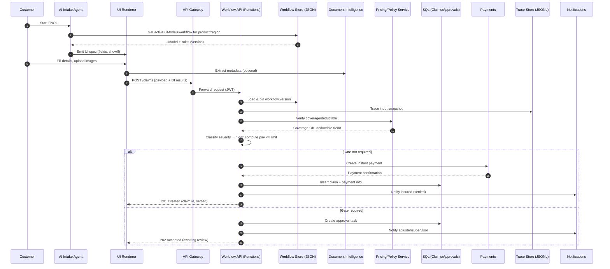
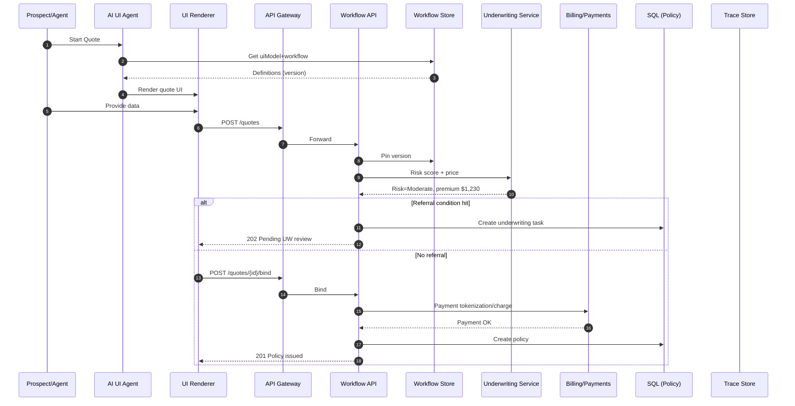

# Small-To-Medium-Business-Solutions

Here’s a **detailed, end-to-end business use case** for a mid-size insurance company that aligns with your “JSON-driven rules + AI-generated UI + REST API” pattern. It’s structured so you can take it straight into design/build on Azure.

# Intelligent Claims & Policy Operations Platform

## Problem & Vision

* **Problem:** Claims and policy operations are slow, manual, and opaque. Intake forms vary by product/region. Straight-through processing (STP) is low; adjusters and underwriters are overloaded; fraud leakage persists.
* **Vision:** A **JSON-rules–driven** platform where **AI agents auto-generate the UI** from a `uiModel`, a **workflow engine** executes business rules (pricing/SLA/approvals/triage), and straight-through cases get **instant decisions**. Humans handle only the exceptions.

## Personas

* **Customer/Policyholder** (FNOL, endorsements, status tracking)
* **Agent/Broker** (quote, bind, endorsements)
* **Underwriter** (risk selection, referrals)
* **Adjuster** (assignment, reserves, settlement)
* **SIU/Fraud Analyst** (investigate flagged claims)
* **Ops Admin / Product Owner** (edits JSON rules, canary & rollback)
* **Compliance/Audit** (traceability, regulatory exports)

## Outcomes & KPIs

* **STP rate**: ≥ 40% for simple glass/towing/low-severity claims
* **FNOL→First Contact**: < 15 minutes (target)
* **Cycle time**: −30% on minor claims; −15% on moderate claims
* **Fraud leakage**: −10% with ML triage + rule gates
* **Bind rate**: +8% via faster quote; abandonment < 10%
* **Audit completeness**: 100% with pinned workflow versions & decision traces

---

# Core Journeys

## A) Quote → Bind (Personal Auto/Home)

1. **Intake** (AI-generated UI from `uiModel`): driver/home details, prior losses, coverages, limits.
2. **Risk & Price**: rules + ML signals (credit surrogate, telematics, roof condition) compute premium; discounts via tier rules.
3. **Referral Gate**: triggers if premium change > threshold, risk score > cutoff, or missing docs.
4. **Bind**: payment and e-policy issuance; documents e-signed; policy ID created; endorsements enabled.

## B) FNOL → Settlement (Claims)

1. **FNOL intake** (AI chat or form from `uiModel`), upload photos, police report, telematics.
2. **Triage & Routing**: JSON rules classify severity, set reserves, assign adjuster/team or go STP.
3. **Approval Gates**: total loss, injury, or high indemnity require supervisor/legal approval.
4. **Estimate & Settlement**: integrate estimating vendor; if within limits and low-risk → **instant pay**; else to adjuster.
5. **Subrogation/Salvage**: if third-party involved or vehicle totaled, create subro/salvage tasks.
6. **Closure**: notify insured, update reserves/final pay, archive decision trace.

## C) Fraud & Triage

* **Rule + ML hybrid**: rules for known patterns (mismatched garaging, late add of coverage), ML for anomaly score.
* **SIU Gate**: if score > threshold or rule hits, route to SIU; otherwise proceed.

## D) Endorsements & Mid-Term Changes

* **UI agent** prompts only fields impacted; rules compute pro-rata premium change; approvals as needed.

---

# Reference Architecture (Azure-lean)

* **UI (web/mobile)**: Generated by AI agent from `uiModel` JSON; renders forms/conversation.
* **API Gateway**: Azure API Management (JWT, rate limit, IP allowlist, headers).
* **Workflow Runtime**: Azure Functions (HTTP + queue triggers) evaluating **JSON steps** (`switch`, `compute`, `gate`, `route`, `httpCall`, `waitUntil`).
* **Rules & UI Models**: Cosmos DB or Blob for **immutable** versions (`workflowId@version` + `uiModel`).
* **Data**:

  * Azure SQL: policies, claims, payments, reserves, approvals, activations.
  * ADLS/Blob: documents (photos, PDFs), decision traces (JSONL).
* **Events/Async**: Service Bus (claim tasks), Event Grid (status events).
* **AI**: Azure OpenAI (UI agent, summarization), Document Intelligence (form extraction), Vision (damage severity), optional Telematics via Event Hubs.
* **Analytics**: Synapse/Databricks + Power BI (KPIs, leakage, SLA, fraud).
* **Security**: Entra ID/B2C, Managed Identity, Key Vault, Private Endpoints, Defender for Cloud.
* **Observability**: App Insights + Log Analytics (end-to-end traces).

---

# Sequence Diagrams

## 1) FNOL Straight-Through (low-severity glass)



## 2) Quote → Bind (referral on risk)



---

# JSON-Driven Rules & UI

## Workflow (FNOL triage excerpt)

```json
{
  "workflowId": "claims.fnol.auto.v3",
  "version": 3,
  "triggers": ["Claim.Created"],
  "steps": [
    {"id":"classify","type":"switch","on":"{{claim.lossType}}",
     "cases": {
       "glass":[{"set":{"severity":"low","slaHours":2}}],
       "towing":[{"set":{"severity":"low","slaHours":2}}],
       "collision":[{"set":{"severity":"med","slaHours":8}}]
     },
     "default":[{"set":{"severity":"med","slaHours":8}}]
    },
    {"id":"coverageCheck","type":"httpCall",
     "request":{"method":"POST","url":"https://policy/api/coverage","body":{"policyId":"{{claim.policyId}}","date":"{{claim.lossDate}}"}},
     "assignTo":"coverage"
    },
    {"id":"approvalGate","type":"gate",
     "condition":"coverage.deductible > 1000 || claim.estimatedIndemnity > 2500 || claim.injury == true",
     "approvers":["role:Supervisor","role:LegalOnInjury"]
    },
    {"id":"instantPay","type":"httpCall",
     "when":"severity == 'low' && claim.estimatedIndemnity <= coverage.limit && !approvalGate.blocked",
     "request":{"method":"POST","url":"https://payments/api/payout","body":{"claimId":"{{claim.id}}","amount":"{{claim.estimatedIndemnity}}"}}
    }
  ]
}
```

## UI Model (FNOL intake excerpt)

```json
{
  "uiModel": {
    "sections": [
      {
        "id":"loss",
        "title":"Loss Details",
        "fields":[
          {"name":"lossType","type":"select","label":"Type of Loss","options":["glass","towing","collision","theft"],"required":true},
          {"name":"lossDate","type":"date","label":"Date of Loss","required":true},
          {"name":"injury","type":"checkbox","label":"Any injuries?"},
          {"name":"photos","type":"file","label":"Upload Photos","accept":["image/*"]}
        ]
      },
      {
        "id":"vehicle",
        "title":"Vehicle",
        "fields":[
          {"name":"vin","type":"text","label":"VIN","requiredIf":"product=='auto'"},
          {"name":"odometer","type":"number","label":"Odometer"}
        ],
        "dynamic":{"showIf":[{"when":"product=='auto'","show":["vin","odometer"]}]}
      }
    ],
    "validation":[
      {"rule":"lossDate <= today()","message":"Date cannot be in the future"}
    ],
    "copy":{"intro":"Tell us what happened. We’ll triage and, if eligible, settle instantly."}
  }
}
```

---

# API Surface (minimal)

* `GET /workflows/{id}/active` → workflow + `uiModel` (pinned by tenant/product)
* `POST /claims` → create FNOL; returns **201 settled** or **202 pending**
* `GET /claims/{id}` → status, SLA, assigned adjuster, decision trace ref
* `POST /claims/{id}/actions/approve|reject` → supervisor/legal gate
* `POST /quotes` → compute premium (may return **202 referral**)
* `POST /quotes/{id}/bind` → issue policy (payment first)
* `GET /requests/{id}/trace` → JSONL decision trace (auditor role)

---

# Data Model (high level)

**Azure SQL**

* `Policies(policyId, product, insuredId, status, effectiveDate, renewalDate, coveragesJson, region)`
* `Claims(claimId, policyId, lossType, severity, status, reserves, paid, createdAt, workflowVersionRef)`
* `Approvals(approvalId, entityType, entityId, approver, status, reason, gateId, decidedAt)`
* `Payments(paymentId, claimId, amount, method, status, txnRef)`
* `WorkflowActivations(tenantId, product, workflowId, version, rolloutPercent, activatedAt, activatedBy, status)`

**ADLS/Blob**

* `/workflows/{workflowId}/{version}.json` (immutable rules + uiModel)
* `/traces/{claimId}.jsonl` (append-only step traces)
* `/docs/{claimId}/...` (photos, PDFs)

---

# Audit, Versioning, & Compliance

* **Pin workflow version** at creation; store in `Claims.workflowVersionRef`.
* **Immutable workflow storage**; only activate/retire mappings.
* **Decision traces** include step inputs/outputs, expressions, and actor decisions.
* **Retention**: traces retained SLA+X years per product/region.
* **Access**: PII masked in traces; `Auditor` role unmask w/ justification; all views logged.

---

# Non-Functional Requirements

* **Throughput**: FNOL bursts (CAT events) → scale out Functions/Service Bus; backpressure via queues.
* **Latency**: simple STP claims < 3s E2E; quote < 5s.
* **Resilience**: idempotent handlers; exactly-once semantic via idempotency keys.
* **Security**: Entra ID, Private Endpoints, Key Vault, CMK for SQL/Storage, least privilege RBAC.
* **Observability**: distributed tracing, request correlation IDs, SLA dashboards.

---

# Phased Rollout

**MVP (8–12 weeks)**

* FNOL for auto glass & towing (highest STP), Payments integration, Notifications
* Quote for personal auto (no referrals), Bind + payment
* Rule editor (JSON upload), canary activation, decision traces

**Phase 2**

* Collision + bodily injury flows (gated), SIU integration, Subrogation/Salvage
* Underwriting referrals; endorsements; document AI for police reports/invoices
* Telematics ingestion, computer vision for damage severity

**Phase 3**

* Homeowners, small commercial packages, catastrophe event orchestration
* Advanced pricing, reinsurance cessions, claim litigation workflows

---

# Risks & Mitigations

* **Rule sprawl** → enforce JSON schema + linter; product-line governance.
* **Fraud false positives** → human-in-the-loop appeals; threshold tuning by line.
* **CAT surges** → pre-scale policies; queue buffering; graceful degradation for non-critical features.
* **Integration churn** → isolate via `httpCall` adapters; contract tests.

---

# Reporting (Power BI)

* **Claims dashboard**: STP%, cycle time, SLA breaches, severity mix, loss ratio, paid vs reserved.
* **Fraud/SIU**: precision/recall, time to disposition.
* **Underwriting**: bind rate, referral volume, premium lift, geography/product splits.

---

If helpful, I can:

* generate **full JSON Schemas** (workflow + uiModel),
* drop **Azure Functions** skeletons for `/claims`, `/quotes`, `/trace`,
* and provide **Mermaid swimlanes** tailored to your exact product lines (auto/home/commercial).
